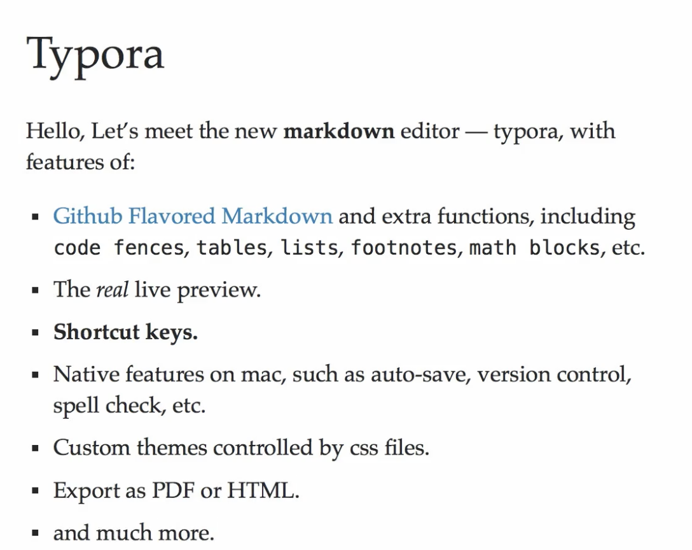
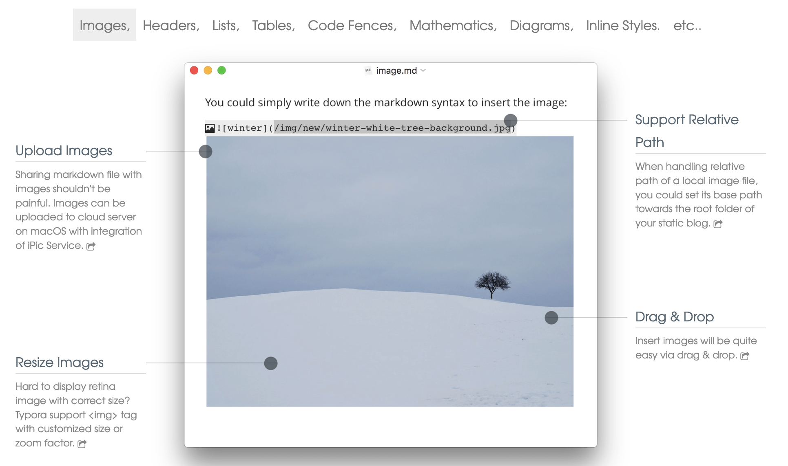
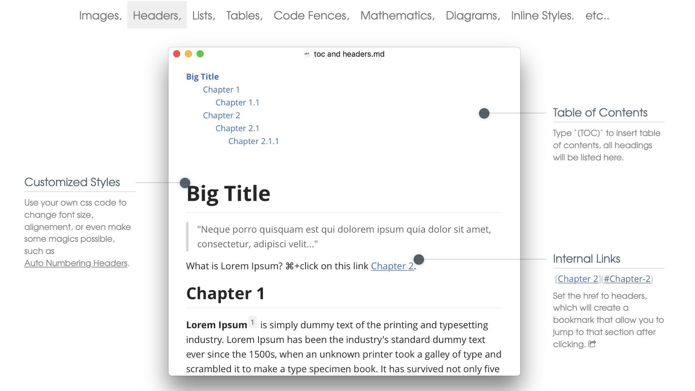
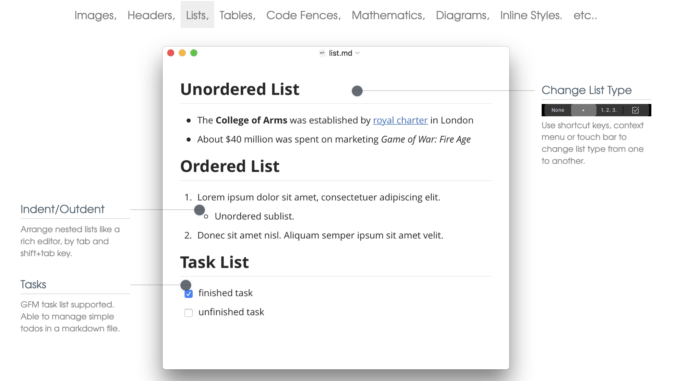
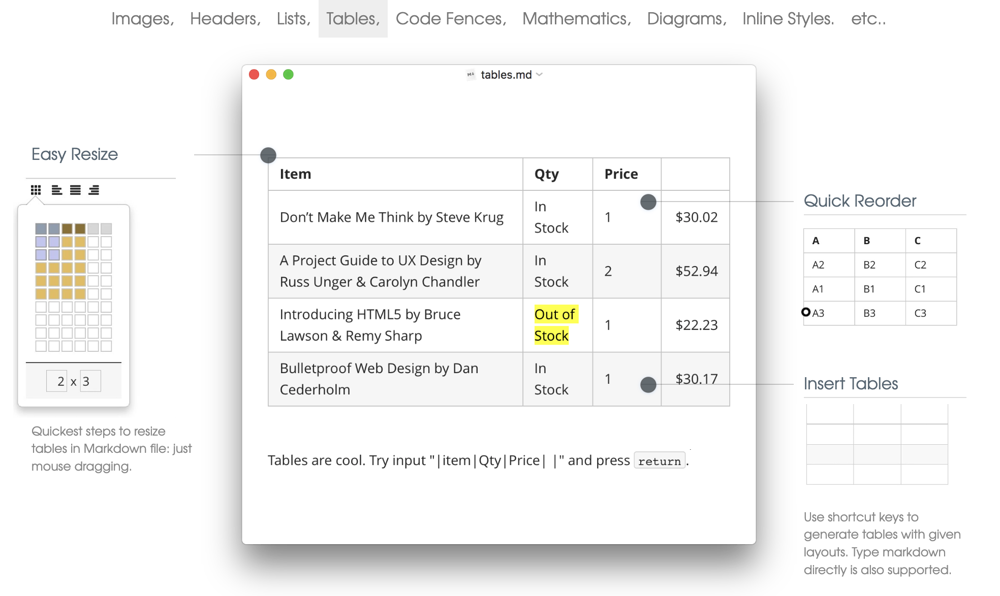
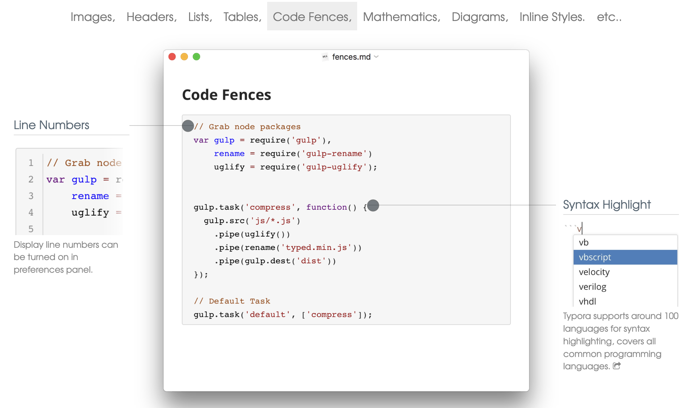
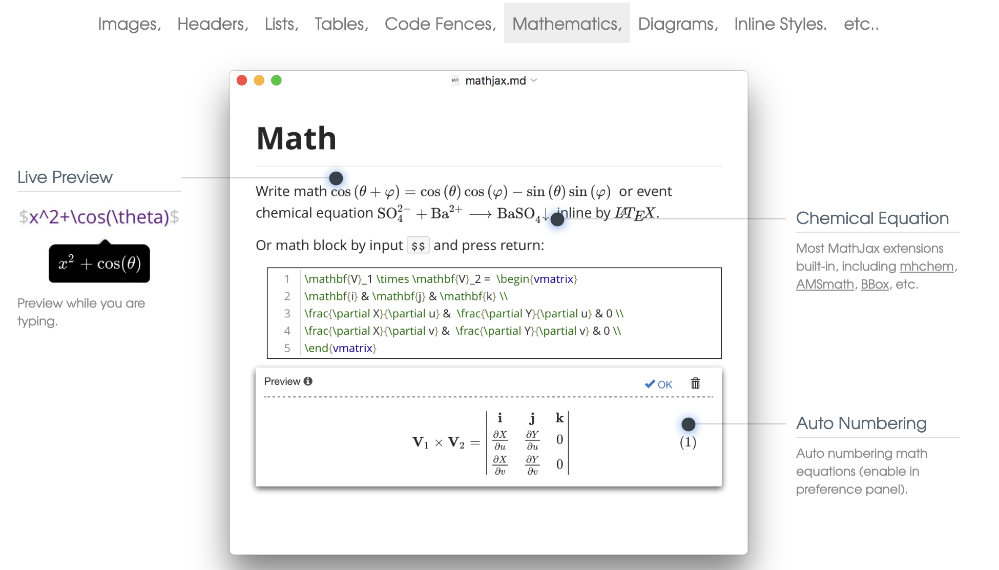
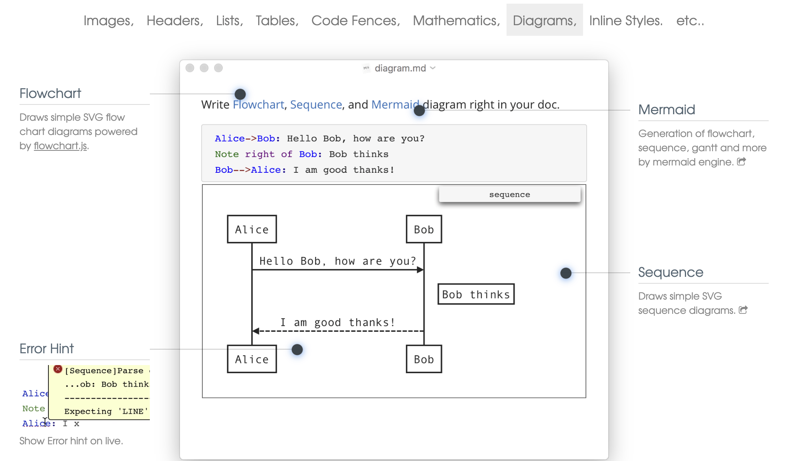
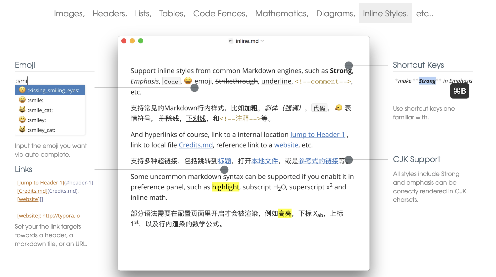

# Typora Hero Priorities

The 10 screenshots below are what Typora chose to put on its landing-page hero. Since their team hand-picked these as "if you only see one thing, see this," they form a strong prior for what to prioritize in Iliad.

Each section captures the screenshot, calls out the affordances Typora highlighted, and notes how Iliad is positioned today and what the natural next step would be.

> **Verdict legend.** Sections below may be tagged with a verdict from [`../source-as-contract.md`](../source-as-contract.md): **REJECTED** = breaks the rule that the on-disk `.md` is ground truth; **BORDERLINE** = acceptable if used deliberately, document the dialect choice. Unflagged sections are safe under the rule.

> **Source images** live in [`./assets/hero/`](./assets/hero). They're saved from Typora's public landing-page hero. Section 10 (the small feature grid) is described in prose only — no source PNG was captured.

---

## 1. The pitch


_Typora's one-paragraph intro and headline feature bullets._

**Visual:** A serif "Typora" heading followed by a short paragraph and a bullet list of headline features. Clean, minimal, single-column landing copy.

**The bullets Typora leads with:**

- GitHub-Flavored Markdown plus extras (code fences, tables, lists, footnotes, math blocks)
- "The *real* live preview"
- Shortcut keys
- Native macOS features — auto-save, version control, spell-check
- Custom CSS-driven themes
- Export to PDF / HTML
- "and much…"

**Takeaway for Iliad:** Typora's positioning is "real WYSIWYG markdown" first, native-platform feel second, theming and export third. Iliad's positioning today (visual Markdown + local files + autosave) matches the top of that hierarchy. Notable gaps in our pitch: themes, export, and a comprehensive shortcut surface.

---

## 2. Images

> **BORDERLINE under [source-as-contract](../source-as-contract.md).** Resize via `` is valid GFM but non-canonical; prefer plain `` when possible. **REJECTED form:** cloud upload that rewrites local refs at save time. An explicit "upload this image" command is fine because the rewrite is user-initiated and visible in the next diff.


_A sample image-insertion doc with Upload, Relative Path, Drag & Drop, and Resize callouts around a rendered snow scene._

**Visual:** A `image.md` document showing a Markdown image insertion (``) with a snow scene rendered inline. Four callout labels around the screenshot.

**Highlighted affordances:**

- **Upload Images** — push local images to a cloud host on save (Typora ships an iPic Service integration on macOS) so a shared `.md` is never broken.
- **Support Relative Path** — option to set a base path so relative image refs resolve from a site root, not just the doc's directory. Useful when authoring for a static-site generator.
- **Drag & Drop** — drop a file from Finder to insert.
- **Resize Images** — switch to `` HTML tag for explicit size or zoom factor (needed for retina sharpness).

**Iliad today:** drag/drop and asset-folder handling work. Resize and base-path-for-site-root are the two natural next steps. Cloud upload is bigger but matches a real authoring pain point.

---

## 3. Headings, TOC & internal links

> **BORDERLINE under [source-as-contract](../source-as-contract.md).** A `[TOC]` token in the source is non-standard but round-trips cleanly if both reader and writer agree; a sidebar outline panel is the safer alternative. Heading auto-numbering is safe **via CSS only** (`counter-reset` / `::before`); **REJECTED** if the editor rewrites the source to insert "1.1" prefixes into heading text.


_A `toc and headers.md` doc with an auto-generated TOC at the top, an `[TOC]` token, internal `#Chapter-2` anchor link, and a customized-styles callout._

**Visual:** A `toc and headers.md` document. At the top, a multi-level bulleted outline (Big Title → Chapter 1 → Chapter 1.1 → Chapter 2 → Chapter 2.1 → Chapter 2.1.1) rendered as blue links. Below it, a large heading "Big Title" with a blockquote and prose, then "Chapter 1" with an example sentence containing an inline link "Chapter 2" and a footnote marker.

**Highlighted affordances:**

- **Table of Contents** — typing a special token (Typora uses `[TOC]`) inserts an auto-generated TOC block that updates as headings change.
- **Internal Links** — `[Chapter 2](#Chapter-2)` jumps to that heading; ⌘-click navigates.
- **Customized Styles** — CSS can drive heading-level changes such as automatic numbering.

**Iliad today:** no outline, no in-doc TOC, no internal heading links. Given the architecture decision to defer secondary navigation, the lightest first step is probably **a `[TOC]` block that renders inline** — it lives in the document, not the chrome. Heading-jump links would follow naturally.

---

## 4. Lists & tasks


_A `list.md` doc with unordered, ordered, and task lists stacked, plus the list-type switcher chip in the upper-right corner._

**Visual:** A `list.md` document showing three list types stacked vertically: an unordered list (two filled bullets), an ordered list ("1." with a nested "o" sublist beneath it), and a task list with one checked and one unchecked GFM checkbox.

**Highlighted affordances:**

- **Change List Type** — a small inline switcher with four icons: "None" (paragraph), bullet, "1. 2. 3." (numbered), checkbox (task). Convert between list styles without retyping. Typora exposes it on the macOS Touch Bar and via context menu.
- **Indent / Outdent** — Tab and Shift-Tab to nest and un-nest list items, the way rich editors behave.
- **Tasks** — GFM task list with native click-to-toggle checkboxes inline.

**Iliad today:** task-list toggle already works. List-type switcher is missing and would be a nice power feature; Tab/Shift-Tab nesting is standard CodeMirror territory and should be free or near-free to implement.

---

## 5. Tables


_A `tables.md` doc with a 4-row book table, a colored 2×3 grid picker on the left, and a Quick-Reorder thumbnail on the right._

**Visual:** A `tables.md` document with a "books" table (Item / Qty / Price columns, 4 rows including one highlighted "Out of Stock" cell). Callouts surround the table. The left-side "Easy Resize" inset shows a grid picker where a 2×3 sub-rectangle is colored in (purple top row, yellow bottom row) — i.e., the cells you'd hover-pick are visually highlighted, with the rest of the grid greyed out. The right-side "Quick Reorder" thumbnail shows a 3×3 mini-table with rows labelled A1/A2/A3, B1/B2/B3, C1/C2/C3 and a small drag-handle dot on the A3 cell, suggesting row-level drag-to-reorder.

**Highlighted affordances:**

- **Insert Tables** — shortcut key opens a grid picker (Typora shows a colored mini-grid where you hover to pick rows×columns, like the one in Word/Pages); typing Markdown pipe syntax also works.
- **Easy Resize** — column widths drag with the mouse; the underlying Markdown updates to match.
- **Quick Reorder** — drag column headers or row handles to reorder rows/columns in place. The mini-thumbnail makes it clear that A→B→C can be re-ordered without rewriting Markdown by hand.

**Iliad today:** basic table rendering exists per `docs/architecture.md`. The interactive layer (insert-by-grid, drag-resize, drag-reorder) is the obvious productization step — and it would dramatically change how usable tables feel.

---

## 6. Code fences


_A `fences.md` doc with a JavaScript fence, a line-numbered inset on the left, and a language-autocomplete dropdown (vb, vbscript, velocity, …) on the right._

**Visual:** A `fences.md` document with a JavaScript code fence (gulp tasks). To the left, an inset showing the same fence with a gutter of line numbers (1–5). To the right, an autocomplete dropdown triggered by typing `v` after the fence backticks, showing language choices `vb`, `vbscript`, `velocity`, `verilog`, `vhdl`.

**Highlighted affordances:**

- **Syntax Highlight** — large catalog (Typora cites ~100 languages).
- **Line Numbers** — togglable in preferences; renders in a gutter.
- **Language autocomplete** when typing the fence's language tag.

**Iliad today:** no code-fence syntax highlighting yet. Adding a Prism/Shiki/Lezer-based highlighter is a high-leverage move — code is everywhere in technical writing. Language autocomplete on the info string is a small UX add that signals polish.

---

## 7. Math


_A `mathjax.md` doc with inline math, a chemistry equation, a matrix block with `(1)` auto-numbering, and a live-preview tooltip on the left._

**Visual:** A `mathjax.md` document showing an inline rendered equation in the text (`cos(θ+φ) = …`), a chemistry formula (`SO₄²⁻ + Ba²⁺ → BaSO₄↓`), and a centered block-mode LaTeX matrix with an auto-numbered "(1)" marker on the right. To the left, a popover showing `$x^2+\cos(\theta)$` being live-previewed as a small rendered tooltip while typing.

**Highlighted affordances:**

- **Live Preview** — a floating tooltip renders the LaTeX as you type, before you commit the dollar-sign block.
- **Chemical Equation** — MathJax extensions (mhchem, AMSmath, BBox) ship by default.
- **Auto Numbering** — opt-in numbering for block equations, with the `(N)` marker rendered on the right.

**Iliad today:** no math. MathJax/KaTeX inline rendering is well-trodden — adding it would unlock an entire category of users (academics, anyone doing technical writing).

---

## 8. Diagrams


_A `diagram.md` doc with a sequence-diagram source fence above its rendered SVG. The bottom-left "Error Hint" callout shows a parser-error popup with red X icon and a message like "Expecting 'LINE'"._

**Visual:** A `diagram.md` document showing a Mermaid sequence diagram. The fence source ("Alice → Bob: Hello Bob, how are you?", note, reply) is at top; below it the rendered SVG shows two boxes labeled "Alice" and "Bob" with arrows between them and a "sequence" tab label in the corner. Bottom-left shows a concrete error-hint UI: a small yellow popup with a red X badge and parser output (e.g., `[Sequence] Parse … Expecting 'LINE'`) appearing inline below the broken fence — i.e., the error renders in place rather than failing silently.

**Highlighted affordances:**

- **Mermaid** — flowchart, sequence, gantt, and more from one engine.
- **Flowchart** — separate `flowchart.js` engine for simple flow shapes.
- **Sequence** — dedicated SVG sequence-diagram rendering.
- **Error Hint** — render errors are shown inline, not silently swallowed.

**Iliad today:** no diagrams. Mermaid via a code-fence info-string (`` ```mermaid ``) is the lowest-friction add — same rendering pipeline as code fences, just with SVG output. Pairs naturally with #6.

---

## 9. Inline elements (emoji, links, CJK, shortcuts)

> **BORDERLINE under [source-as-contract](../source-as-contract.md).** Highlight (`==x==`), subscript (`H~2~O`), and superscript (`x^2^`) are dialect choices — supported by some Markdown parsers, not others. Pick once, write the choice down, stick with it. Emoji autocomplete, links, CJK rendering, and bold/italic keyboard shortcuts are safe.


_An `inline.md` doc with paired English/Chinese paragraphs of inline styles, an emoji autocomplete popover on the left, and a ⌘B shortcut callout on the right._

**Visual:** An `inline.md` document with English and Chinese paragraphs side by side, showing inline strong/emphasis/`code`/emoji/strikethrough/underline/`<!--comment-->`/highlight/subscript/superscript styles. A left-side popover shows an emoji autocomplete: typing `:smi` reveals matches like `:kissing_smiling_eyes:`, `:smile:`, `:smile_cat:`, `:smiley:`. Below that, a reference-style links panel with `[website]: http://typora.io` syntax. On the right, a callout illustrating `*make Strong in Emphasis*` selected, with ⌘B shown as the trigger for inline bold.

**Highlighted affordances:**

- **Emoji** — `:shortcode:` autocomplete dropdown.
- **Reference links** — both inline and `[id]: url` reference style.
- **Shortcut keys** — comprehensive Cmd/Ctrl-based mapping (B for bold, I for italic, etc.).
- **CJK support** — bold/italic detection works correctly in CJK character sets.

**Iliad today:** basic Markdown styles render. Emoji autocomplete is a delightful small feature; CJK-correct bold is a robustness concern. The bigger gap is **comprehensive keyboard shortcuts** — Typora has a full menu-driven map, Iliad has a handful.

---

## 10. Feature grid (Files, Outline, Export, Word count, Focus mode, Auto-pair)

> _(No source PNG captured for this section — description below is from direct observation of the original hero.)_

**Visual:** Two rows of three tiles, each tile showing a small thumbnail and a feature title.

- Top row:
  - **Organize Files** — thumbnail of a sidebar with "Articles" list (Custom Shortcut Keys.md, Quick Start.md) next to a doc body. Caption: works with Dropbox / iCloud-style sync folders.
  - **Outline Panel** — thumbnail of a vertical outline panel ("Markdown For Typora → Overview → Block Elements → Paragraph and line breaks → Headers → Blockquotes → Lists → Task List") next to a doc.
  - **Import & Export** — icon of a `.md` file with arrows pointing to PDF / HTML / DOC / generic-file icons. Mentions Word, OpenOffice, LaTeX, MediaWiki, EPUB.
- Bottom row:
  - **Word Count** — thumbnail of a popover showing Minutes / Lines / Words / Characters with sample numbers (9 / 437 / 2504 / 16845).
  - **Focus Mode & Typewriter Mode** — body text where surrounding paragraphs are faded out, leaving the current paragraph in focus.
  - **Auto Pair** — abstract glyph showing `{[(*wo*)]}` with paired brackets and a small "wo" icon. Auto-pairs brackets, quotes, and Markdown symbols like `*` and `_`.

**Highlighted affordances:**

- File panel **plus** an articles/flat-list panel (two ways to navigate the workspace).
- Outline as a dedicated side panel, not a popover.
- Export covers far more than PDF/HTML — DOCX, OpenOffice, LaTeX, MediaWiki, EPUB.
- Word count includes **reading minutes** as a first-class metric (not just words).
- Focus mode and typewriter mode together — different functions with different keybinds.
- Auto-pair extends beyond brackets to Markdown emphasis markers.

**Iliad today:** file tree exists but no second navigation surface; no outline; no export; no word count; no focus or typewriter mode; no auto-pair.

---

## Prioritization read

Reorganizing the 10 hero blocks by how directly they extend what Iliad already does well:

### Tier 1 — directly extend the current writing surface

These are inside Iliad's stated scope (visual Markdown + local-first) and should be the cheapest wins:

- **#5 Tables** — grid-picker insertion, drag-resize, drag-reorder. Iliad has rendering; this is the productized editing layer.
- **#6 Code fences** — syntax highlighting + language autocomplete on the info string.
- **#8 Diagrams** — Mermaid via the existing code-fence pipeline.
- **#7 Math** — MathJax/KaTeX inline render with live preview while typing.
- **#3 Outline / TOC** — start with an inline `[TOC]` block; defer a sidebar outline panel since chrome should stay minimal.
- **#4 Lists & tasks** — list-type switcher, Tab/Shift-Tab nesting.

### Tier 2 — meaningful new capability

Bigger lifts but each unlocks a real user need:

- **#10 Word count + Focus mode + Typewriter mode + Auto-pair** — these are all small individually, together they add up to a "real writing app" feel.
- **#2 Images** — resize and base-path-for-site-root. Cloud upload is bigger but matches Typora's #1 image gripe.
- **#9 Shortcut keys** — full comprehensive shortcut map, not just the basics.

### Tier 3 — out of current scope but worth knowing

- **Export to PDF / HTML / DOCX / EPUB** (#10) — Typora considers this top-tier; Iliad's architecture defers it. Worth keeping in mind that it's the #3 hero bullet on their landing page.
- **Themes** (#1) — Iliad has a typography popover but no full CSS theming system. Worth deferring.

### Notable observations

- **Typora's hero leans heavily on rendered constructs** — math, diagrams, code, tables, lists, emoji. Six of ten screenshots are about "Markdown construct X renders nicely inline." This is the trajectory `docs/architecture.md` already endorses, just farther along it.
- **Outline & TOC are top-tier for them** but contradict our current "no secondary navigation" stance. The TOC-as-document-block path is a way to ship the value without breaking the chrome principle.
- **Auto-pair, focus mode, typewriter mode, word count** are all small individually, but collectively they're 4 of 6 tiles in the closing feature grid — i.e., Typora considers them table-stakes for a writing app.
- **Cloud image upload** shows up twice (image bullets + native iPic service mention). Suggests Typora hears about this constantly from users sharing markdown.
