# Typora Feature Reference — How-Tos (Part 1: Editing, View, Writing)

> Own-words summaries of Typora's How-To documentation for editing/view features, for use as inspiration for Iliad. Source URLs are linked at each section.

> **Verdict legend.** Sections below may be tagged with a verdict from [`../source-as-contract.md`](../source-as-contract.md): **REJECTED** = breaks the rule that the on-disk `.md` is ground truth; **BORDERLINE** = acceptable if used deliberately, document the dialect choice. Unflagged sections are safe under the rule.

## Auto Numbering

> **CONDITIONAL under [source-as-contract](../source-as-contract.md).** Safe when implemented purely with CSS (`counter-reset` + `::before` content) — the source stays plain headings. **REJECTED** if the editor rewrites heading text to inject "1.1.2" prefixes; that's an implicit source mutation that fights with any user edit to the heading.

Source: https://support.typora.io/Auto-Numbering/

Typora doesn't ship heading numbering as a toggle — instead it exposes the styling layer and lets users drop CSS counters into `base.user.css` or `[theme].user.css` to auto-number headings (h1–h6) hierarchically. The same trick can be extended to the **outline panel** and the **table of contents** so generated numbering shows up everywhere, not just in the body.

Notable affordances:

- **Per-theme or global CSS overrides** via `base.user.css` (applies to every theme) and `<theme>.user.css` (applies only to the matching theme), with the article pointing at pre-baked snippets on Pastebin for the TOC and outline numbering rules.
- **Focus state hook**: the `md-focus` class lets users style the focused heading differently, e.g. dim the numbering when not focused.
- **Collapsable outline panel**: referenced as a preference toggle that affects how the numbering rules interact with the sidebar.

The takeaway for Iliad: Typora treats heading numbering as a styling concern, not a content concern — the numbers never enter the Markdown source, which keeps documents portable. A similar "CSS counter" trick could power optional numbering without polluting files.

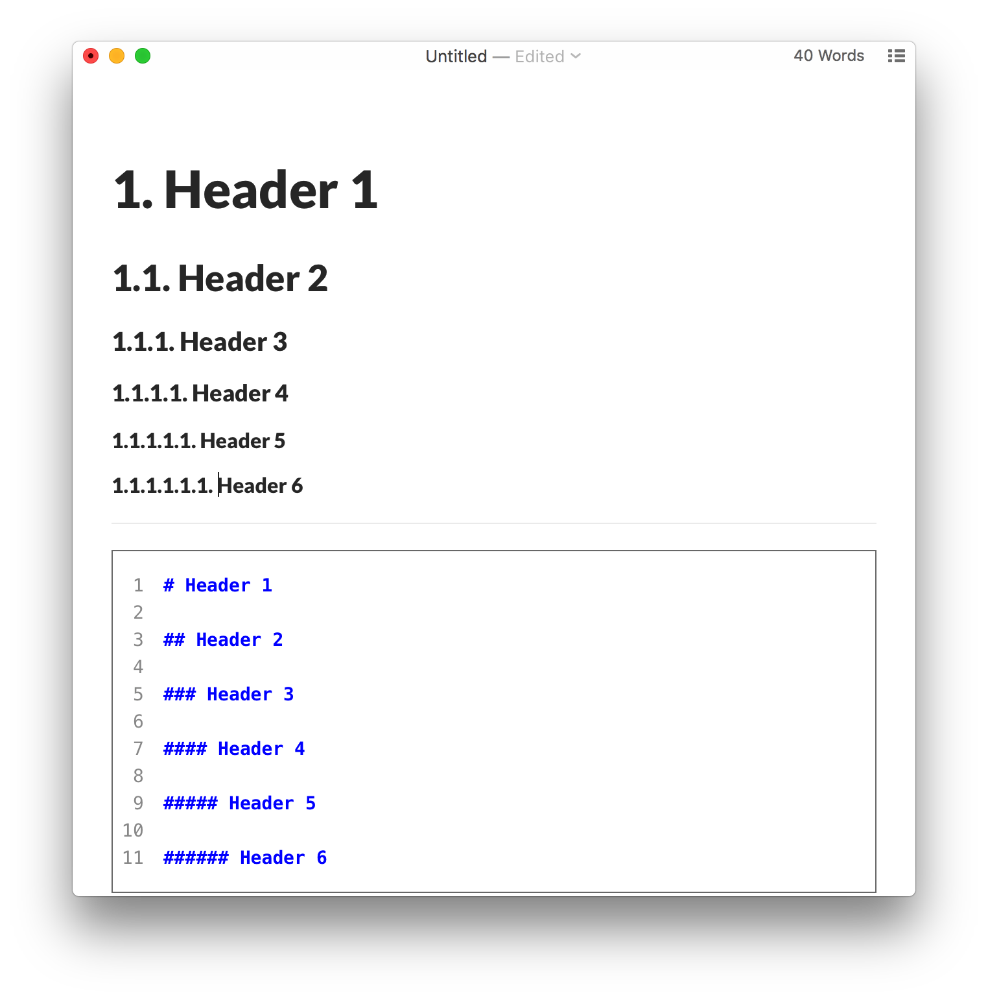
_Headings rendered with hierarchical auto-numbering applied via custom CSS._

---

## Custom Font

Source: https://support.typora.io/Custom-Font/

Font choice in Typora is layered on top of the active theme: users can either nudge **font size** from a Preferences slider or fully override the typeface by writing CSS into `base.user.css`. The CSS path supports both **web fonts** loaded via `@font-face` from a URL (e.g. Google Fonts) and **local font files** placed in the theme folder's `fonts/` subdirectory, referenced with a relative URL.

Affordances and details:

- **Preferences → font size** lives under General on macOS and Appearance on Windows/Linux; Ctrl+F search inside Preferences helps locate it quickly.
- **Selector targets**: `body` for prose, `#typora-source` for the source-code editing view, and `#md-fences` for code blocks/inline code. The CSS variable `--monospace` is the canonical hook for code font.
- **Format**: `woff2` is the recommended file type.

Two screenshots in the article: one demonstrating a Courier-replaced body, and one showing the font-size control inside Preferences.

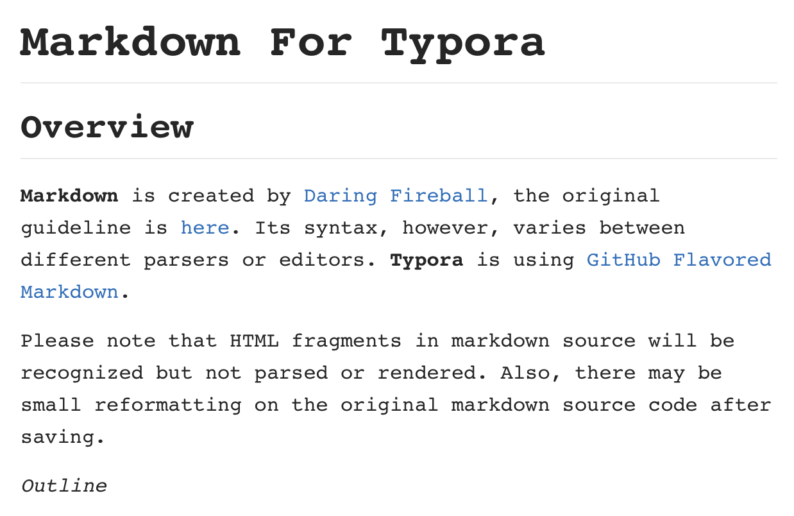
_Body text rendered after overriding the theme font to Courier via custom CSS._

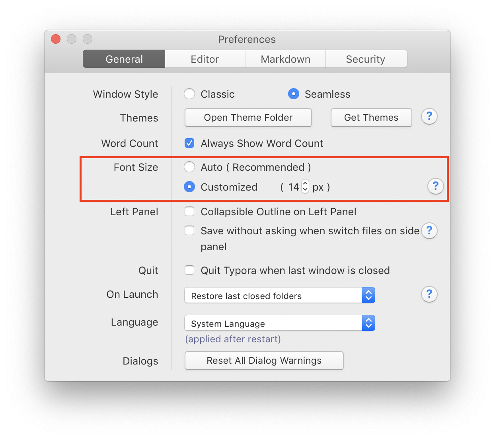
_The Preferences panel's font-size adjustment slider._

---

## Background

Source: https://support.typora.io/Backgound/

This article shows how to swap the editor's background using nothing but CSS — there's no first-class "set background" UI. Users target the `content` element with `background-image` plus `background-repeat` and `background-position` to control tiling, and tweak `#write`'s `padding-left`, `margin-top`, `margin-bottom`, and `min-height` (via `calc()`) so the writing area stays readable on top of the artwork.

For darker images, the article suggests stacking a semi-transparent `rgba()` color on the body so the underlying paper-style write area remains legible. It also notes that dark-mode detection can hinge on the body's background color, which has implications for theming.

Two reference screenshots are included — a notebook-paper texture and a faded "crashed ship" backdrop with a translucent overlay.

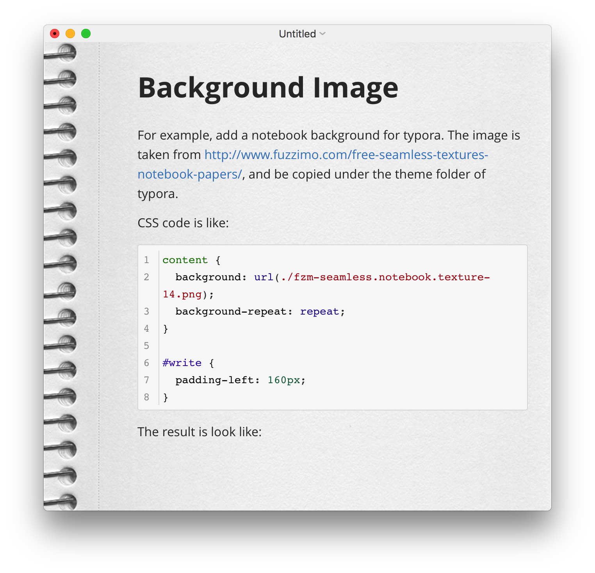
_Editor with a notebook-paper texture set as background._

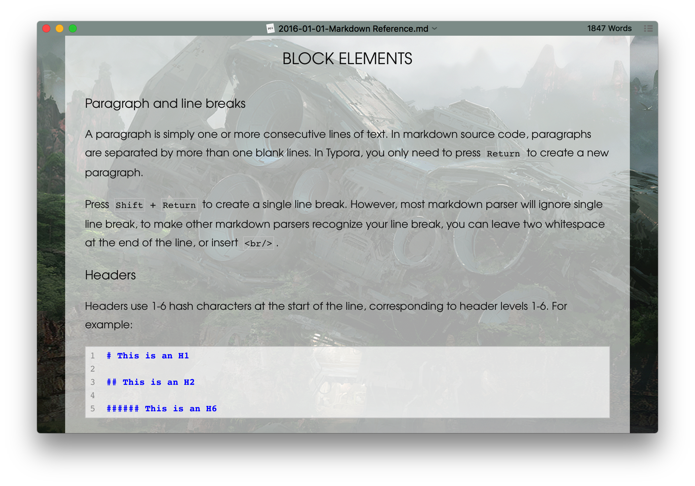
_Image background with a translucent overlay applied to the write area._

---

## Add Custom CSS

Source: https://support.typora.io/Add-Custom-CSS/

This is the master "how to extend Typora visually" article. Typora loads CSS in a fixed cascade — base styles, then the active theme, then `base.user.css`, then `<current-theme>.user.css` — giving users two override slots: one that survives theme switching and one that only kicks in for a specific theme. Both files live in the theme folder, which Preferences exposes via an **Open Theme Folder** button under Appearance.

What makes this powerful:

- **Live debugging with DevTools**: macOS adds an *Enable Debug* item to the Help menu, after which the right-click context menu gets *Inspect Elements*. Windows/Linux exposes *Toggle DevTools* under the View menu. Users can therefore poke around the live DOM exactly like in Chrome/Safari.
- **Theme filename is case-sensitive** — the user-CSS file must match the theme's actual filename character-for-character.
- **Updates are safe**: user CSS lives outside the theme bundle, so theme updates don't blow away tweaks.
- Requires Typora 0.9.12+ on Windows or 0.9.9.5.1+ on macOS.

The "open the theme folder + drop in a `.user.css`" pattern is a clean separation of user customization from shipped assets and is worth mirroring in Iliad.

---

## Change Styles in Focus Mode

Source: https://support.typora.io/Change-Styles-in-Focus-Mode/

When Focus Mode is on, Typora adds an `.on-focus-mode` class to the body and an `.md-focus` class to the currently focused block — the styling that dims everything else is just CSS. Users can override the unfocused appearance globally by setting the CSS variable `--blur-text-color`, or dial in much finer control by writing rules against specific selectors.

The article enumerates the hooks Typora exposes:

- `.on-focus-mode` — present on `<body>` whenever Focus Mode is engaged.
- `.md-focus` — applied to the currently focused block element.
- `.md-focus-container` — applied to a list item whose child block is focused, so you can keep its parent visible.
- `.md-end-block` — leaf-level blocks that can't contain children (useful for paragraph-level rules).
- `.CodeMirror-activeline` and `.CodeMirror-focused` — let users style focus differently inside code fences and the source-mode editor.
- `.task-list-item` — for differentiating checkbox styling between focused and unfocused list items.

Common moves: drop `opacity` on images so they fade out away from focus, change `color` per block type, and treat the source-code mode separately. The pattern of "the app exposes semantic classes; users do the rest with CSS" is consistent across Typora.

---

## Resize Image

> **BORDERLINE under [source-as-contract](../source-as-contract.md).** Switching to `` is valid GFM but non-canonical Markdown; other renderers may ignore the attributes. Prefer plain `` when visual fidelity isn't critical. If you ship this, treat it as an explicit "I want to override the default" gesture, not the default code path.

Source: https://support.typora.io/Resize-Image/

Markdown's image syntax has no size attributes, so Typora's solution is to let users drop down to inline `` tags when they need control. Three ways to size:

- **`width`/`height` attributes** on the `` tag directly.
- **`style` attribute** with `width`/`height` for finer (e.g. percentage, max-width) control.
- **`zoom`** factor inside `style` to scale Retina-resolution images down to their intended display size while keeping crisp rendering.

Anything else placed in `style` is preserved on export (HTML/PDF) but ignored by Typora's editor preview — handy for export-only tweaks like floats, margins, or borders that you don't want cluttering the edit view. This dual treatment (editor ignores, exporter honors) is an interesting UX choice for any app that has to balance WYSIWYG fidelity with downstream export.

---

## Auto Save

Source: https://support.typora.io/Auto-Save/

Auto-save behavior splits down OS lines:

- **macOS** delegates to the system's document-based app autosave. There's no in-app toggle; instead users tune two checkboxes in System Settings → Desktop & Dock: *Ask to keep changes when closing documents* and *Close windows when quitting an application*. Turning both off gives a seamless "close without prompting / reopen exactly where you were" experience.
- **Windows/Linux** has an explicit toggle in Preferences. Default cadence is every 5 minutes; users can tweak `autoSaveTimer` (minutes) inside `conf.user.json` via the **Open Advanced Settings** button. A **Recover Unsaved Drafts** button surfaces files that were closed without saving, named `{date}-{filename}.md`. Untitled docs get auto-named from the first heading or sentence.

UI patterns worth borrowing: surfacing recovery as a single button rather than burying it in a folder; auto-deriving filenames from document content.

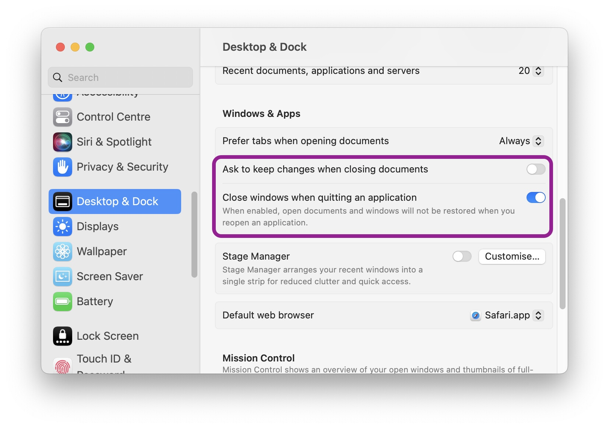
_macOS System Settings showing the two checkboxes that govern Typora's autosave behavior._

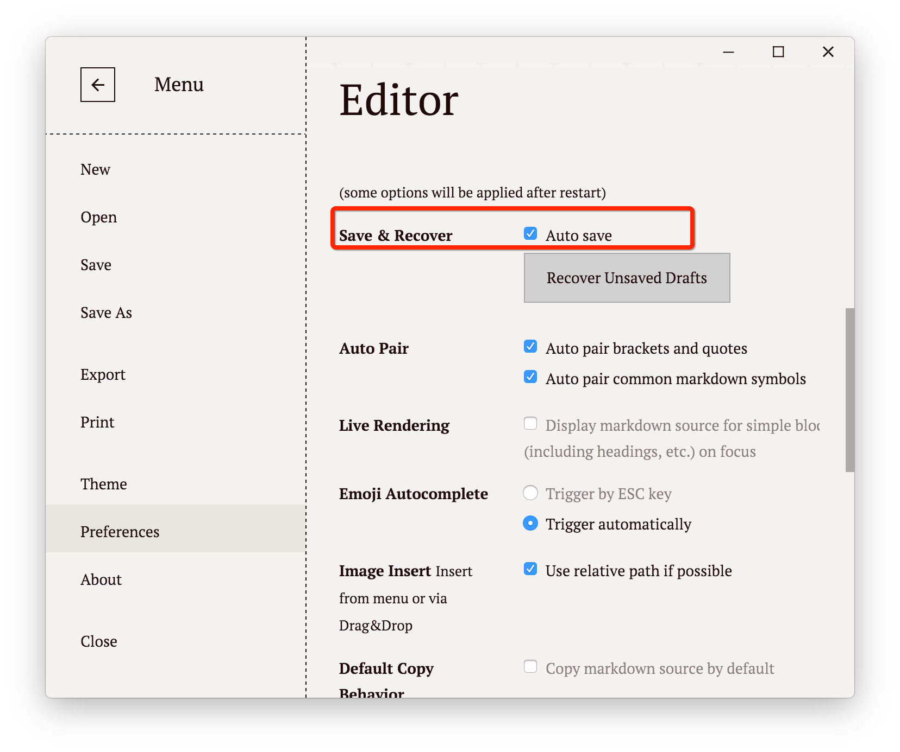
_The Recover Unsaved Drafts button in Typora's Windows/Linux Preferences._

---

## Version Control

Source: https://support.typora.io/Version-Control/

Typora doesn't bake in a Git-like history of its own; it leans on the OS:

- **macOS**: *File → Revert To → Browse All Versions* hands off to macOS's native versioning UI (Time-Machine-style scroll-through). Untitled drafts live in `~/Library/Autosave Information`.
- **Windows/Linux**: there's no native equivalent, but the *Recover Unsaved Drafts* button under Preferences → File restores anything caught by autosave on crash or close. Windows users are pointed at the OS-level *File History* feature for longer-term versioning.

The takeaway is restraint — rather than build a parallel history system, Typora points users at OS facilities where they already exist. For Iliad (Electron-based, cross-platform) this matters: macOS gets versioning effectively for free if the app is a proper NSDocument; Windows/Linux likely needs a homegrown solution.

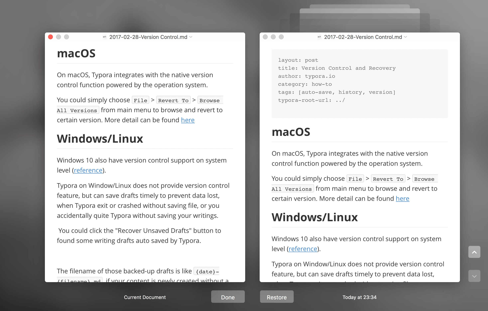
_macOS's native version browser surfaced through Typora's File menu._

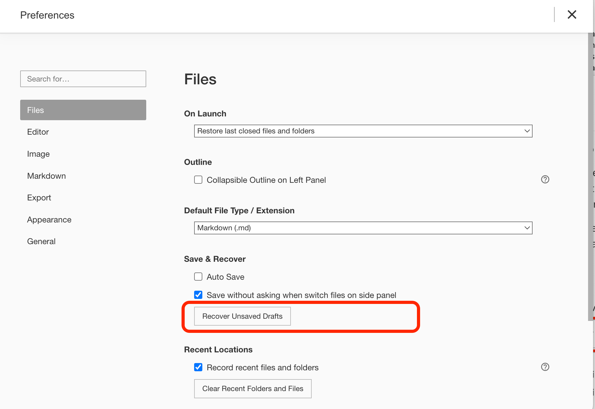
_Preferences panel showing the Recover Unsaved Drafts button for Windows/Linux._

---

## RTL

Source: https://support.typora.io/RTL/

Right-to-left support is treated as experimental — there's no toggle in Preferences. Users opt in by writing one CSS rule: `direction: rtl;` on `#write`. The article warns the maintainer doesn't use RTL personally so bug reports are welcome.

The lesson here is mostly cautionary: shipping a complex feature half-finished and hiding it behind user CSS is a way to support a niche audience without committing to first-class polish. For Iliad, true RTL support would mean handling text selection direction, list/blockquote indentation flip, and bidi runs — none of which a single CSS line solves.

---

## Task List

Source: https://support.typora.io/Task-List/

Task lists use the standard GFM `- [ ]` / `- [x]` syntax and render as live, clickable checkboxes. Toggling a box flips the source on disk. For users who prefer keyboard:

- **Paragraph → Task Status** menu changes the state of the current item.
- A **custom keyboard shortcut** can be bound through Typora's custom-key-binding mechanism.

Styling hooks: `.task-list-done` and `.task-list-not-done` classes can be styled with custom CSS — the common example shown is applying `text-decoration: line-through` and dimming the color on completed items, giving a satisfying visual confirmation without changing the source.

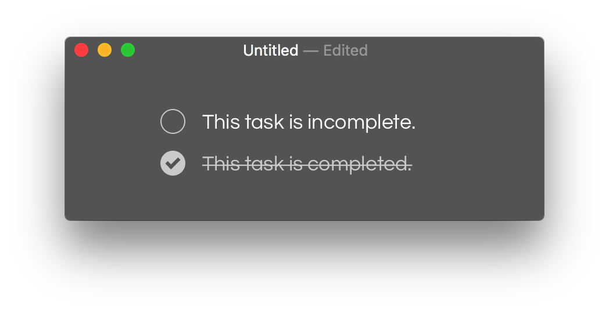
_Checked task items shown with strikethrough and dimmed color via custom CSS._

---

## Auto Pair

Source: https://support.typora.io/Auto-Pair/

Two independent toggles control auto-pairing:

- **Auto pair brackets and quotes** — the usual code-editor pairing of `()`, `[]`, `{}`, and quote characters.
- **Auto pair common markdown syntax** — extends pairing to `*`, `~`, `` ` ``, and `_`, so emphasis/code spans get closed automatically.

A third, context-dependent layer kicks in if related features are enabled in the Markdown preferences: `=` pairs only when *highlight* is on, `$` pairs only when *inline math* is on, `^` pairs only when *superscript* is on. For `~`, `=`, and `^`, the closing character is not auto-inserted after a single press — instead, selecting text first and then pressing one of those characters wraps the selection (e.g. highlight a word + press `=` twice → `==word==`).

That selection-wrap pattern is a nicer expansion of vanilla auto-pair behavior and worth pinching for any editor that supports inline Markdown decoration.

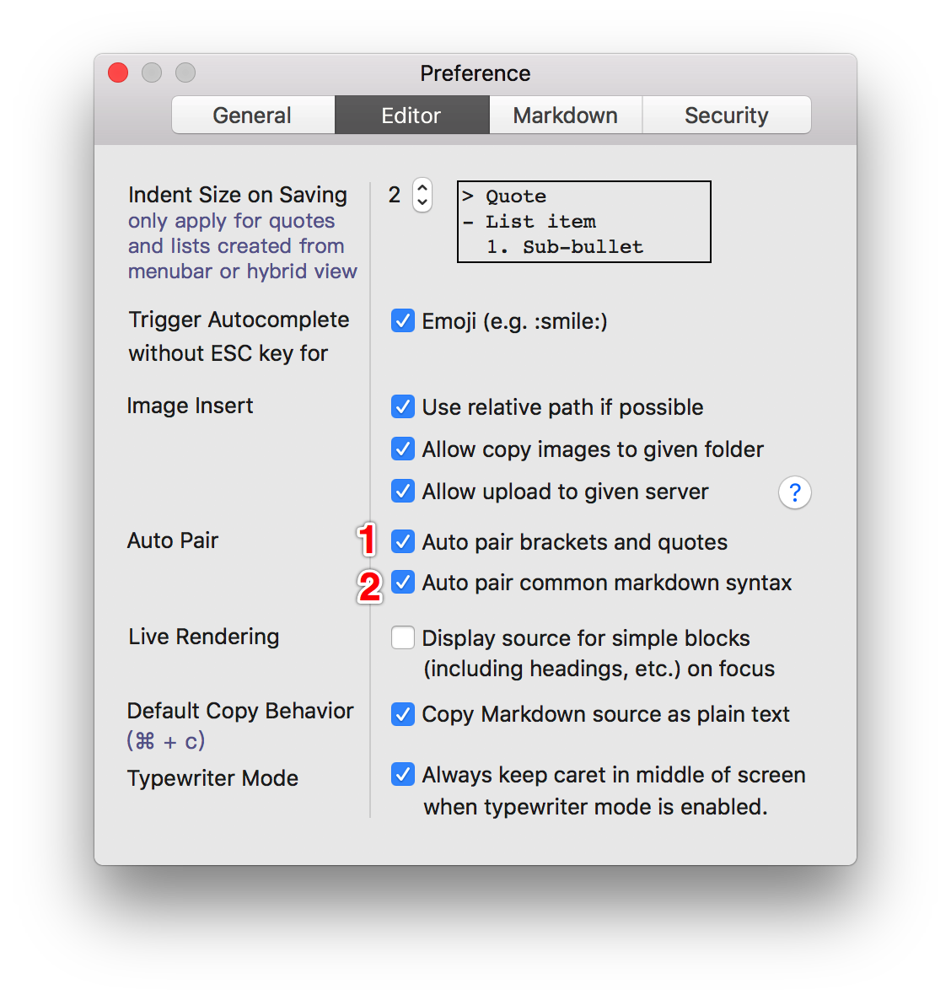
_Preferences panel showing the auto-pair toggle options._

---

## Page Breaks

> **REJECTED by [source-as-contract](../source-as-contract.md).** Implementing this requires `

` (or similar HTML) in the source — layout markup leaking into Markdown. The file stops being a portable document; other renderers (GitHub, Pandoc, the AI) see meaningless HTML scaffolding.

Source: https://support.typora.io/Page-Breaks/

For PDF export, Typora automatically inserts page breaks before every top-level heading (h1), skipping the first one. CSS controls let users push this further: place h1s on right-hand pages only, prevent a heading from being orphaned as the last paragraph on a page, force h2s onto a new column/page, or keep clusters of consecutive headings together.

For manual breaks, three approaches:

1. **Inline HTML**: `

` dropped into the Markdown.
2. **Class + stylesheet**: `

` paired with a CSS rule in user CSS.
3. **Thematic break repurposing**: a horizontal rule (`***`, `---`, `___`) can be styled to trigger a page break, so the Markdown stays clean.

The article enumerates the full CSS 2 and CSS 3 break properties (`page-break-before|after|inside`, `break-before|after|inside` with values like `auto`, `avoid`, `always`, `left`, `right`, `recto`, `verso`, `column`, `region`). The thematic-break-as-page-break trick is a neat way of staying in Markdown while encoding a layout concept.

---

## Strict Mode

> **ALIGNED with [source-as-contract](../source-as-contract.md).** This feature enforces the rule at the writing surface — the editor refuses to interpret non-canonical or ambiguous Markdown. Worth borrowing the spirit (perhaps as the default behavior), even if not the exact UI.

Source: https://support.typora.io/Strict-Mode/

Strict Mode is a Preferences → Markdown toggle that forces strict GFM compliance. Off (the default), Typora is forgiving — it'll render `#Heading` (no space after the hash) as a heading, and it'll allow sloppy indentation when continuing paragraphs inside list items. Turning Strict Mode on requires:

- A space after `#` for headings.
- Exact whitespace alignment for paragraphs nested under list items.
- Correct indentation for sub-lists.

The setting requires a **Typora restart** to take effect. This is a useful pattern: ship a permissive parser by default, but give power users a switch to enforce the canonical spec when they need to author documents that have to render correctly in other engines (GitHub, Gitea, etc.).

---

## Width of Writing Area

Source: https://support.typora.io/Width-of-Writing-Area/

Three CSS knobs control the writing column:

- `#write { max-width: ... }` — the maximum content width.
- `#write { padding-left: ... }` / `padding-right: ... }` — to nudge the column off-center.
- `#typora-source .CodeMirror-lines { max-width: ... }` — independent width for the source-code editing view.

The article notes the CSS requires Typora ≥ 0.9.9.6 (macOS) or ≥ 0.9.13 (Windows). The comparison screenshots show how the same content reflows when you constrain the column vs. widening it out.

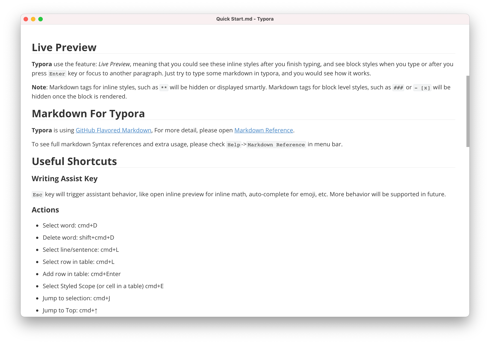
_Writing area constrained to a narrow max-width._

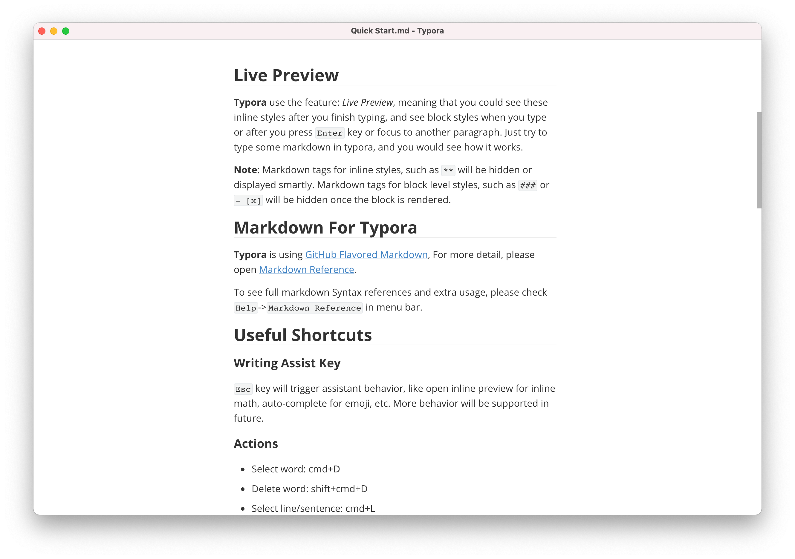
_Writing area at a wider max-width for comparison._

---

## Line Break

Source: https://support.typora.io/Line-Break/

This is one of the more nuanced features. Markdown's treatment of single line breaks is ambiguous — some parsers collapse them, some preserve them. Typora exposes the choice as a setting (and even via a top-bar menu).

Behaviors and shortcuts:

- **Enter** creates a new paragraph (inserts two newlines in source mode).
- **Shift+Enter** inserts a hard line break inside the current paragraph.
- A trailing double-space + newline also produces a hard break (canonical Markdown).
- ` ` is honored as a hard break.
- `&nbsp;` covers the "I really mean it" case of sequential whitespace.
- Sequential whitespace is preserved while editing but stripped on export/print unless `whitespace: pre-line;` is used in CSS.

Two ways to configure: Preferences → Markdown → Whitespace/LineBreak, or **Edit → Whitespace and Line Breaks** in the menu bar, which exposes the same options as a quick switcher. Surfacing parser-level toggles in a top-level menu (not just buried in Preferences) is a smart move when users frequently swap between document conventions.

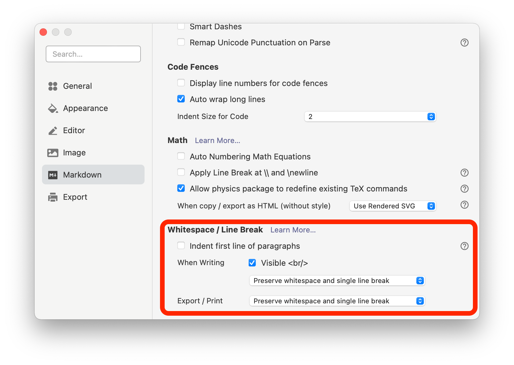
_Preferences panel showing the whitespace and line break configuration options._

---

## SmartyPants

> **REJECTED by [source-as-contract](../source-as-contract.md).** This feature silently rewrites the user's typed punctuation (`"` → `“`/`”`, `--` → `—`, `...` → `…`). The user types one thing and the file stores another — exactly the failure mode the rule exists to prevent. It produces diff churn, surprises round-trips, and breaks any AI suggestion that emits canonical ASCII punctuation.

Source: https://support.typora.io/SmartyPants/

Typora's smart-punctuation system handles two conversions: **smart quotes** (straight to curly) and **smart dashes** (`--` → en dash, `---` → em dash, `...` → ellipsis). Both have menu-bar items and matching Preferences toggles.

The really interesting design choice is how conversions are persisted, exposed as three modes:

- **Convert on Input** — the curly/dash glyph is typed into the file as you write, so the source file contains the converted character.
- **Convert on Rendering** — source stays ASCII (`"`, `--`, `...`), but the edit/preview view displays the typographic version.
- **Remap Unicode Punctuation on Parse** — the inverse: if a file already has curly quotes, Typora swaps them back to ASCII so Markdown parsers downstream (which might look for `"`) still work.

Escapes: `\"` and `\-` opt a single occurrence out. Undo cancels an unwanted conversion. On macOS there's `alt+-` for direct en-dash entry when Convert-on-Input is enabled. The article also nudges users to OS-level text replacement (System Preferences on macOS; third-party apps elsewhere) for arbitrary string expansion. On Windows/Linux, the Preferences panel additionally lets users pick which quote pair pattern to use.

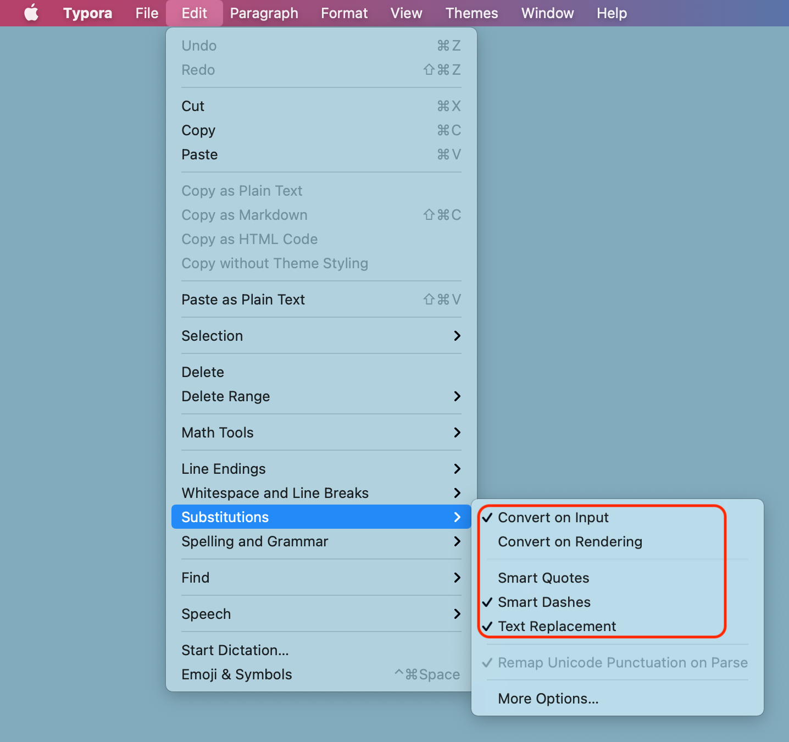
_Menu/preference option for enabling Smart Quotes._

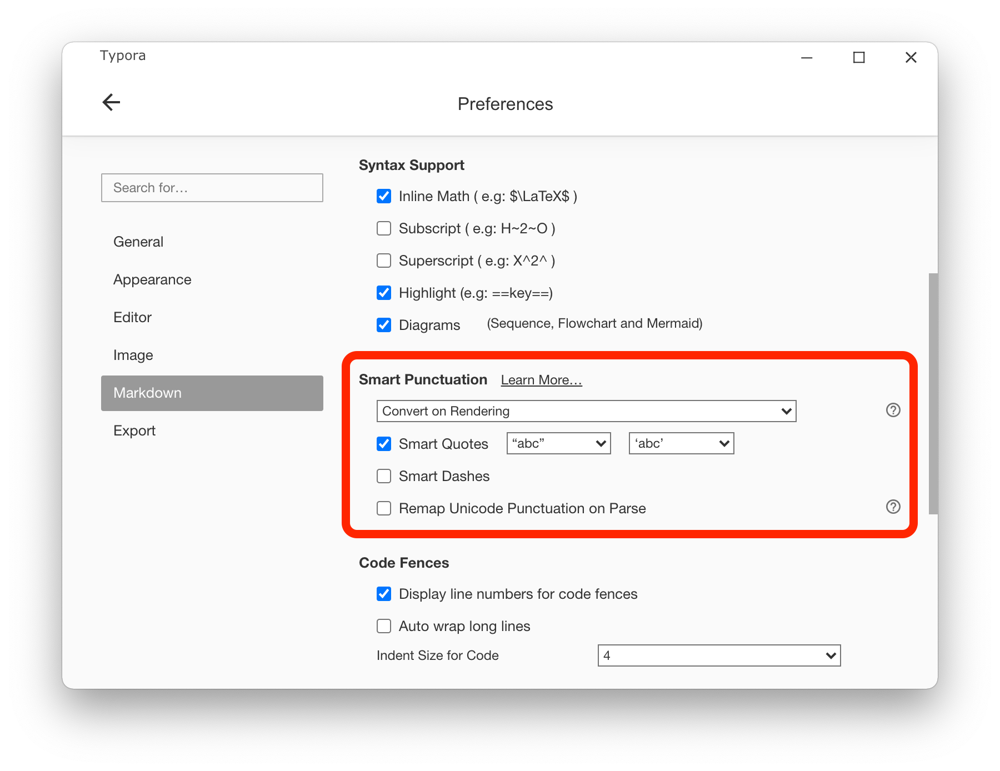
_Quote pair pattern selector available on Windows/Linux._

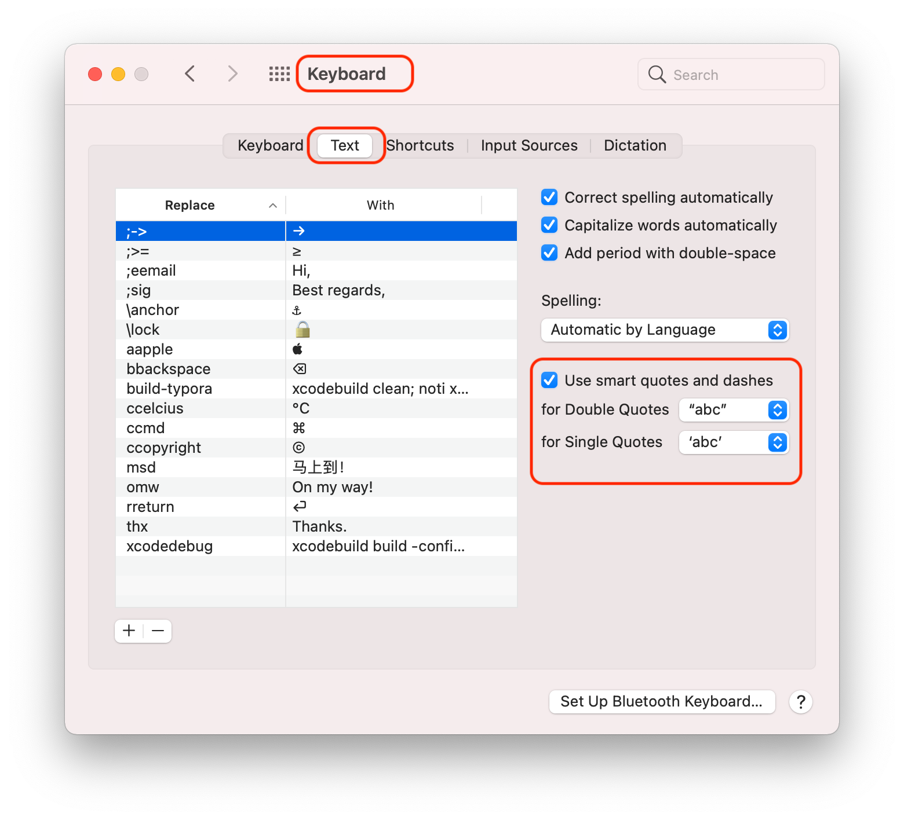
_macOS System Preferences text replacement settings, suggested as a complement to Smart Punctuation._

---

## Media

> **REJECTED by [source-as-contract](../source-as-contract.md).** Embedded video and web content is implemented by writing HTML `<iframe>` / `<video>` tags into the source. The resulting `.md` stops being a portable document — other renderers may sandbox the iframe, strip it, or render it inconsistently, and the AI assistant has no clean way to reason about embedded media as "document content."

Source: https://support.typora.io/Media/

Markdown's image syntax is image-only, so Typora exposes everything else via HTML tags:

- **Video**: `<video src="...mp4" />`. Drag-and-drop a video file into the editor and Typora inserts the tag automatically. Path-handling options for images (relative paths, image root path) apply equally to video paths.
- **Audio**: `<audio src="...mp3" />`. Same path semantics.
- **Embedded web content**: `<iframe>` is supported, intended for paste-in embed code from services like YouTube. Some script-based embeds work; others are blocked by the iframe sandbox, which has no access to the local file system or content writing. A future option to whitelist iframes was mentioned.
- **PDFs**: embedding via `<iframe>` is no longer supported natively — users are directed to online viewers as a workaround.

The drag-and-drop → auto-insert pattern is worth lifting. So is the **path inheritance** — making video/audio honor the same root-path rules as images means users only configure one setting.

---

## Dark Mode

Source: https://support.typora.io/Dark-Mode/

Typora respects the OS's color-scheme preference on both macOS and Windows. When the system is in dark mode, Typora can be configured to auto-switch to a designated dark theme; in light mode, it uses a different theme. The two are set independently inside Typora's theme picker.

Theme authors can also write **single-theme files that respond to both modes** by using `@media (prefers-color-scheme: dark)` queries, mirroring the modern web pattern. The article links out to the broader Themes documentation and a Theme Gallery for downloadable themes.

This is a healthy reference architecture: OS-driven preference + per-mode theme selection in app + CSS media queries inside themes for fine-grained styling. Each layer can be skipped without breaking the others.

_macOS Appearance setting that drives Typora's auto theme switching._

_Windows color-mode setting that drives Typora's auto theme switching._

_Typora's theme picker showing separate light/dark theme selection._

---

## Word Count

Source: https://support.typora.io/Word-Count/

Word count is surfaced two ways:

- **Status bar** (Windows/Linux) showing live count; toggled via Preferences → Appearance → *Show Status Bar*.
- **Title bar hover** on macOS by default (toggleable in Preferences → Appearance).

Either entry point opens a **statistics popup** showing lines, characters, words, and estimated reading time. The reading-time estimate is driven by a configurable words-per-minute setting in Preferences → Appearance. Users can change the default unit displayed in the corner. Selecting a range of text updates the count to reflect just the selection.

Markdown-savvy counting: the article calls out that the **word count excludes Markdown syntax** (e.g. list bullets, hashes), but **character count includes it**. Chinese characters count as one word each — a thoughtful detail for non-Latin scripts.

The View menu also has a Word Count toggle. Multiple, redundant entry points for the same affordance (menu, hover, status bar) tend to make a feature feel native rather than buried.

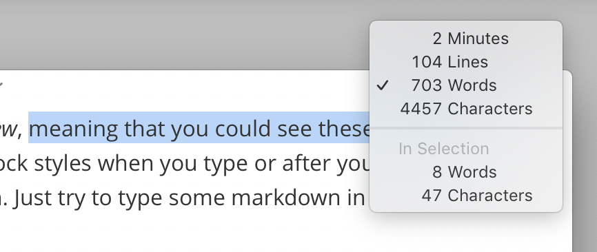
_Word count statistics popup showing words, characters, lines, and reading time._

---

## Focus and Typewriter Mode

Source: https://support.typora.io/Focus-and-Typewriter-Mode/

Two complementary writing modes, both toggled from the View menu:

- **Focus Mode** dims everything except the active line/block, similar to iA Writer's focus mode. Combined with the focus-mode CSS hooks (`.on-focus-mode`, `.md-focus`) users can tune exactly how aggressive the dimming is.
- **Typewriter Mode** keeps the caret at a fixed vertical position (by default, the middle of the window), scrolling the document around it instead. There's a Preferences toggle — *Always keep caret in middle of screen when typewriter mode is enabled* — that, when off, only centers the caret during active typing rather than constantly chasing the mouse selection.

These are foundational distraction-reducing features for any serious Markdown editor; the two-toggle-in-preferences refinement is worth keeping in mind (default "always center" vs. "only while typing" are meaningfully different UX experiences).

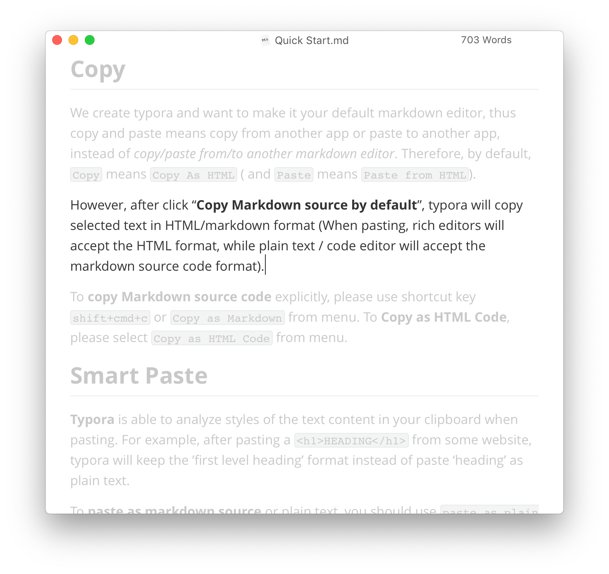
_Editor view with Focus Mode active — surrounding paragraphs dimmed._

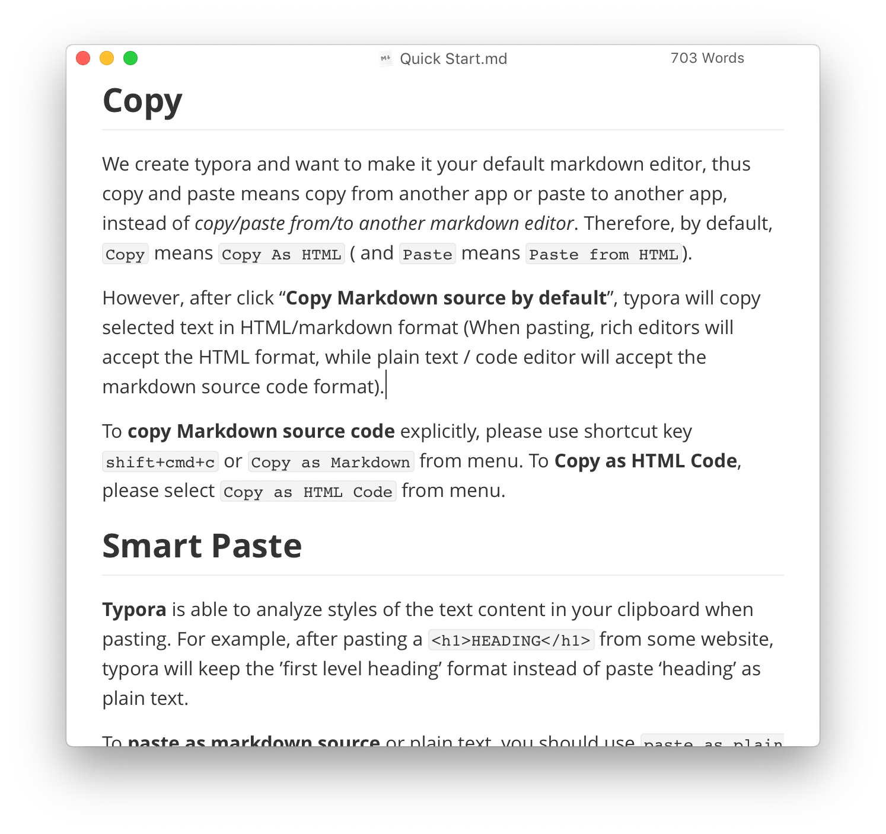
_Same editor view with Focus Mode off — all paragraphs at full opacity._

---

## Copy and Paste

> **BORDERLINE under [source-as-contract](../source-as-contract.md).** Paste that converts rich-text formatting into canonical Markdown is safe if the conversion is deterministic and visible (user can see what got pasted). "Smart-paste" behaviors that silently normalize punctuation, smart-quote on paste, or rewrite whitespace fall into the same trap as SmartyPants and should be avoided.

Source: https://support.typora.io/Copy-and-Paste/

The clipboard story is unusually rich. When you copy in Typora, the clipboard is filled with **four representations at once**: HTML, RTF, plain text, and Markdown. The target app picks the best fit — paste into Gmail and you get styled HTML; paste into VS Code and you get Markdown source.

Menu items and shortcuts:

- **Cmd/Ctrl+Shift+V** — paste as plain text / match style.
- **Cmd/Ctrl+Shift+C** — copy as Markdown source.
- **Copy without Theme Styling** — strips font, size, color, line-height; preserves semantic formatting only (useful when pasting into Word/Pages where you want the destination's styles to win).
- **Copy as HTML Code** — puts raw HTML markup in the clipboard as plain text (useful when targeting code editors).

Paste behavior into Typora flips the logic: HTML clipboard content is converted back to Markdown; if no HTML is available, it falls back to plain text or Markdown source. A Preferences → Editor toggle, *Copy Markdown source as plain text*, changes the default copy behavior so that the plain-text representation is the raw Markdown rather than rendered text.

This is the single richest "interop with the rest of the desktop" feature in the docs and is a good North Star: a Markdown editor that gets clipboard right unlocks workflows with every other app on the system.

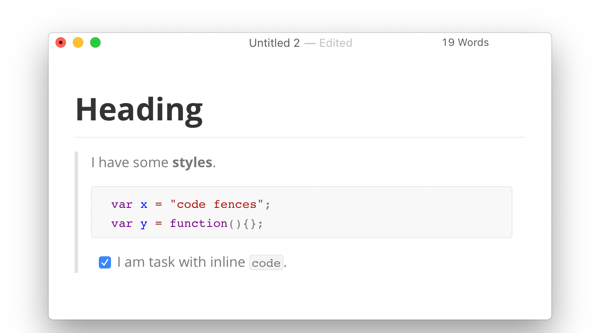
_Selected content being copied from Typora._

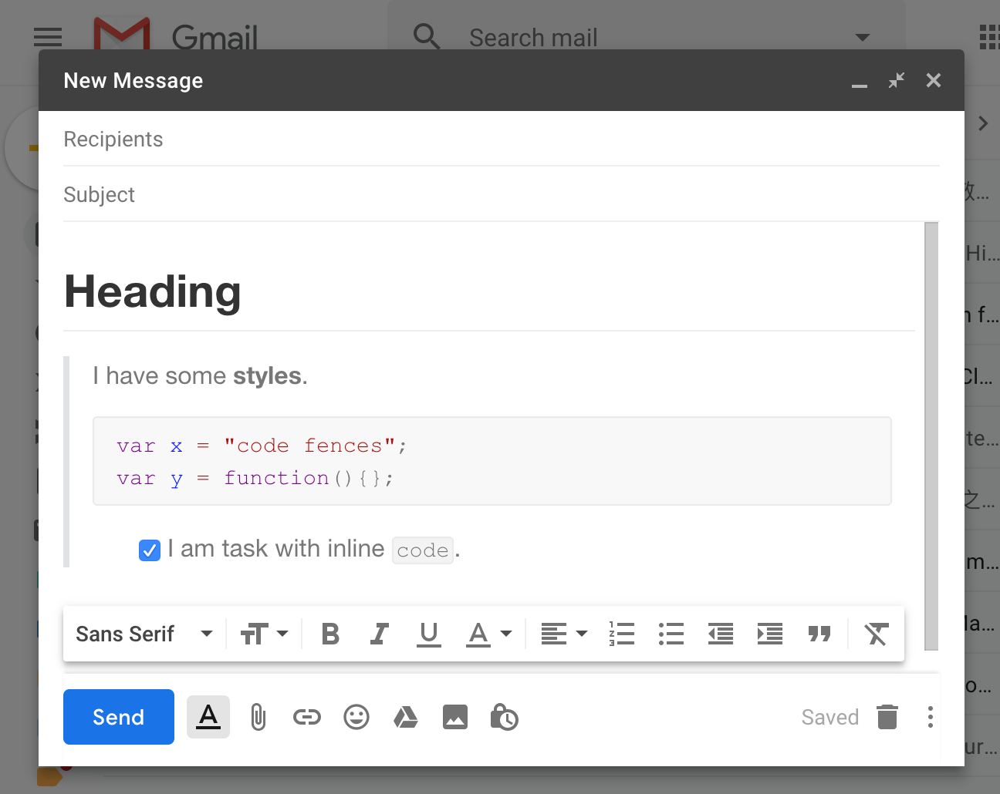
_Same clipboard content pasted into Gmail as rich HTML._

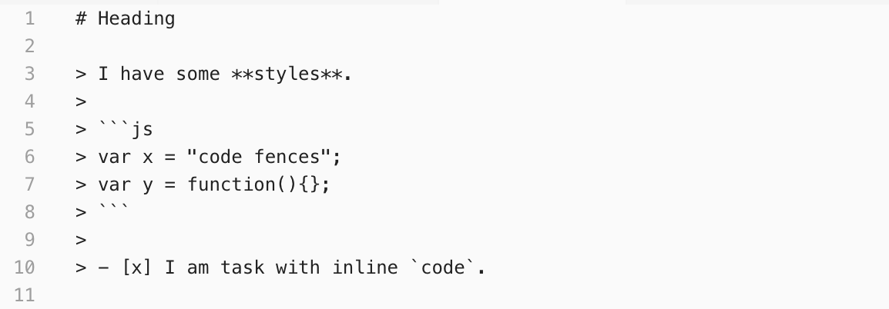
_Same clipboard content pasted into VS Code as Markdown source._

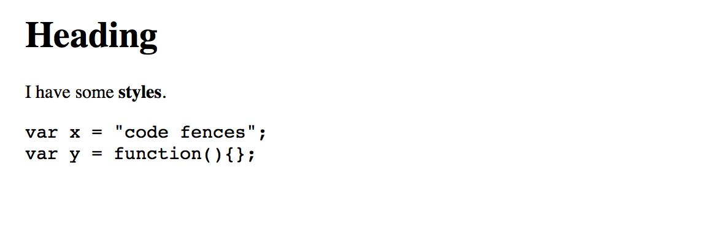
_Copy without Theme Styling pasted into Pages — semantic formatting kept, theme styles stripped._

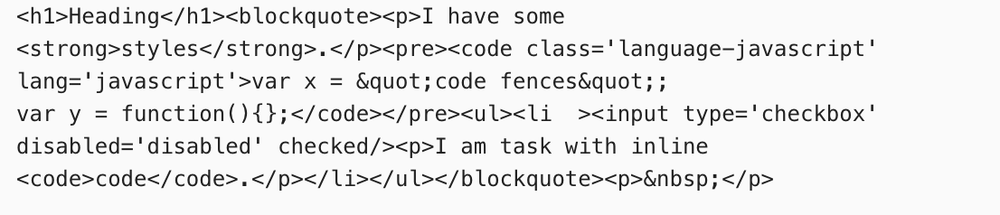
_Copy as HTML Code action pasted into VS Code, showing raw HTML markup._

---

## Zoom

Source: https://support.typora.io/Zoom/

Zoom is universal across platforms. Entries:

- **View menu → Zoom** with platform-standard shortcuts.
- **Cmd/Ctrl + mouse wheel** for continuous zoom.
- **Two-finger pinch** on macOS trackpads, with an *Allow Magnification* checkbox in the View menu to disable the gesture if it's getting in the way.

When the view is zoomed, a small hint panel appears in the upper-right corner showing the current zoom level with controls to adjust or reset. Use cases the docs call out: classroom instruction and presentation mode where you want to make a section large on the fly without opening Preferences.

Recent versions added a configuration toggle (screenshot dated 2023) controlling whether mouse-wheel zoom requires a modifier key — useful for distinguishing scroll from zoom.

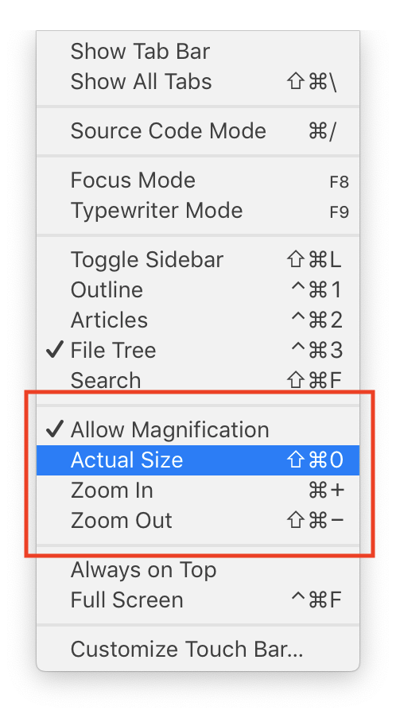
_The View menu's Zoom submenu._

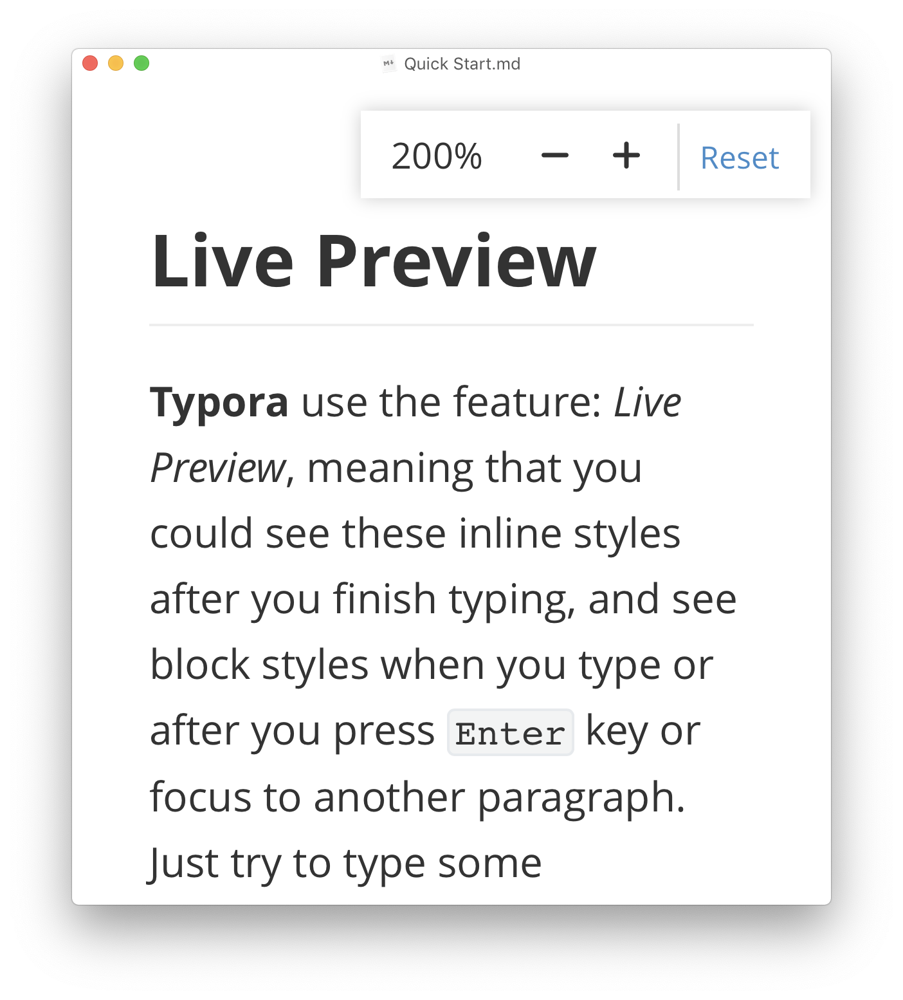
_Zoom hint panel in the upper-right corner when the view is zoomed._

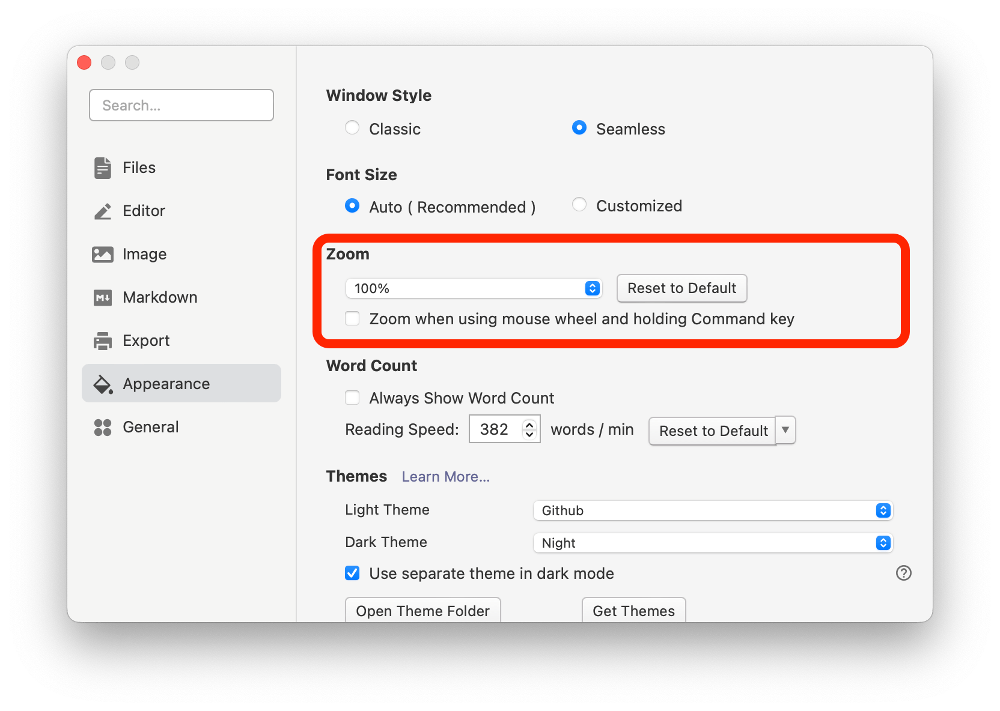
_Configuration option toggling whether mouse-wheel zoom requires a modifier key._

---

## Code Block Styles

Source: https://support.typora.io/Code-Block-Styles/

Code fences are rendered by CodeMirror, so any CodeMirror theme can be ported by:

1. Renaming the theme class from its original (e.g. `cm-s-material`) to `cm-s-inner` — Typora's standard wrapper class.
2. Dropping the CSS into `base.user.css` or `<theme>.user.css`.
3. Optionally adding rules against `.md-fences` (the fenced block wrapper) for font-family/color/background and `.md-fences .code-tooltip` for the small popovers.

This is a clean reuse pattern — instead of building a syntax theming system from scratch, lean on CodeMirror's existing ecosystem and just remap the class name. Iliad's own code-block solution could do the same trick with whichever editor engine it uses.

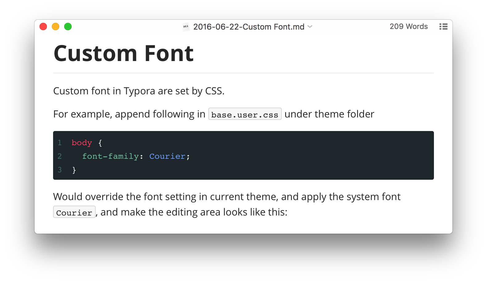
_Code block rendered with a Material CodeMirror theme ported to Typora._

---

## Line Spacing

Source: https://support.typora.io/Line-Spacing/

Spacing — both within a paragraph and between paragraphs — is exposed through CSS. The article gives a small reference of `line-height` values:

- `1.0` — no extra space, very tight.
- `1.2` — compact.
- `1.4`–`1.6` — comfortable; matches most theme defaults.
- `1.8`–`2.0` — double-spaced.

Per-element targets: headings (`h1`–`h6`), paragraphs (`#write p`), list items (`#write li`), code blocks (`.md-fences`), and blockquotes. Inter-paragraph spacing uses `margin-top`/`margin-bottom`. The docs include two ready-to-paste presets: a **Compact Layout** (`line-height: 1.3`, minimal margins) and a **Relaxed Layout** (`line-height: 2.0`, increased margins).

Like elsewhere, spacing isn't a UI control — it's just CSS. The presets approach (Compact / Relaxed) is a useful design pattern: rather than expose 12 fields, offer a couple of named layouts users can drop in and tweak.

---

## List Style

Source: https://support.typora.io/List-Style/

Both ordered and unordered list markers are controlled with `list-style-type`. Beyond the obvious decimal/disc defaults, the article enumerates the full set of CSS values Typora supports and renders each one as a screenshot, including locale-aware options.

Ordered lists:

- **decimal** — 1, 2, 3 (default)
- **decimal-leading-zero** — 01, 02, 03
- **cjk-ideographic** — Chinese numerals
- **hiragana** / **katakana** — Japanese kana counters
- **lower-alpha** / **upper-alpha** — a, b, c / A, B, C
- **lower-greek** — α, β, γ
- **lower-roman** / **upper-roman** — i, ii, iii / I, II, III

Unordered lists:

- **disc**, **circle**, **square** — the classic CSS bullets.
- **Custom string** — `list-style-type: "* ";` lets users write any literal text as a marker.
- **Emoji marker** — `list-style-type: "😎 ";` works just as well, since strings accept any Unicode.

Nested lists can be styled differently per level by chaining selectors (`ol ol`, `ol ol ol`). The custom-string syntax in particular is a great reminder that the browser's CSS engine already gives you most of what users want — no need for a custom marker DSL.

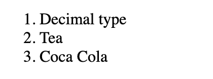
_Default decimal list markers._

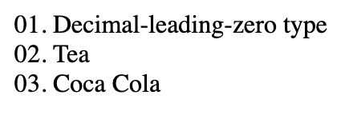
_decimal-leading-zero markers._

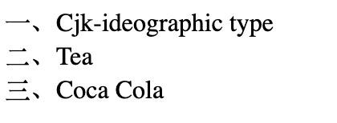
_cjk-ideographic markers._

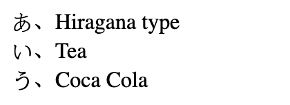
_Japanese hiragana counters._

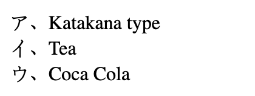
_Japanese katakana counters._

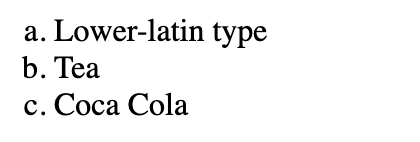
_lower-alpha (a, b, c) markers._

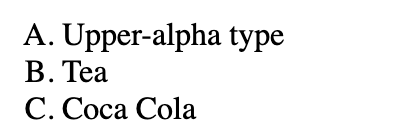
_upper-alpha (A, B, C) markers._

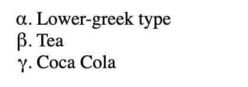
_lower-greek (α, β, γ) markers._

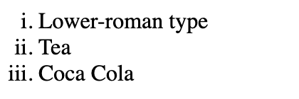
_lower-roman markers._

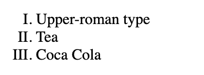
_upper-roman markers._

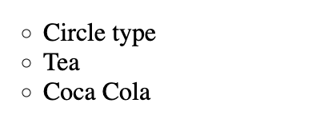
_circle bullets for unordered lists._

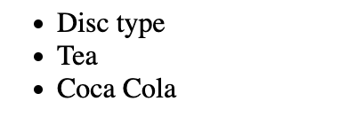
_disc bullets._

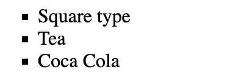
_square bullets._

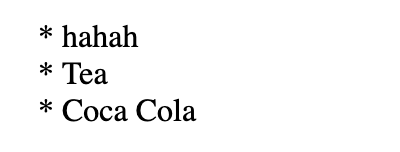
_Custom text marker using `list-style-type: "* ";`._

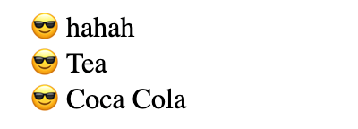
_Custom emoji marker using `list-style-type: "😎 ";`._

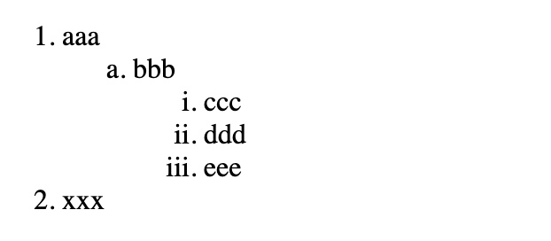
_Nested lists where each level uses a different `list-style-type`._
