# Typora Feature Reference — How-Tos (Part 2: Export, Integration, Advanced)

> Own-words summaries of Typora's How-To documentation for export/integration/advanced features, for use as inspiration for Iliad. Source URLs are linked at each section.

> **Verdict legend.** Sections below may be tagged with a verdict from [`../source-as-contract.md`](../source-as-contract.md): **REJECTED** = breaks the rule that the on-disk `.md` is ground truth; **BORDERLINE** = acceptable if used deliberately, document the dialect choice. Unflagged sections are safe under the rule.

## Install and Use Pandoc

Source: https://support.typora.io/Install-and-Use-Pandoc/

Pandoc is the external engine Typora relies on for its richer import/export formats. The article walks through installing it per platform (the standard installer flow on macOS and Windows, Homebrew or Winget for power users, the system package manager on Linux, and noting that the Snap build of Typora already ships Pandoc inside its sandbox). Once Pandoc is on the machine, Typora picks it up automatically — but **users can also paste an explicit Pandoc binary path** under Preferences → Export → General when auto-detection fails.

Pandoc unlocks two distinct categories of file operations in Typora. **Import** appears under File → Import (and as drag-and-drop) and covers `.docx`, `.latex` / `.tex` / `.ltx`, `.rst`, `.org`, `.wiki`, `.dokuwiki`, `.textile`, `.opml`, and `.epub`. **Export** adds heavier targets that the built-in HTML/PDF cannot handle: docx, odt, rtf, EPUB, LaTeX, MediaWiki, and a richer HTML pipeline. Pandoc runs silently in the background — Typora spawns it, captures the result, and the user never sees a CLI window.

For the Iliad team, this is the canonical example of bolting a heavy converter onto a thin editor: the editor stays small, the conversion matrix is delegated, and the path is exposed as a single config field.

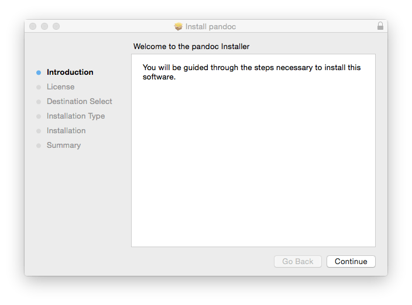
_Screenshot of the Pandoc `.pkg` installer running on macOS._

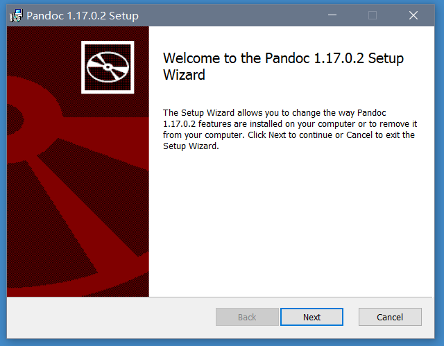
_Pandoc Windows `.msi` installer screen._

_Preferences → Export pane showing the manual Pandoc path entry field._

---

## Open from Sublime Text

Source: https://support.typora.io/Sublime/

This page documents a community-built Sublime Text plugin (by Asoul) that pipes the file currently open in Sublime into Typora. It installs through Package Control as **"Typora.app Markdown"**. Once installed, users invoke it via the Command Palette (`super+shift+p`) and pick **"Markdown: Open with Typora.app"**, or use the Tools → Open with Typora menu item.

The plugin only targets Sublime 2/3 on macOS. It's a useful pattern for Iliad: **a hand-off integration** that lets developers stay in their code editor for text wrangling and jump into a WYSIWYG editor only for prose passes, without bouncing through Finder.

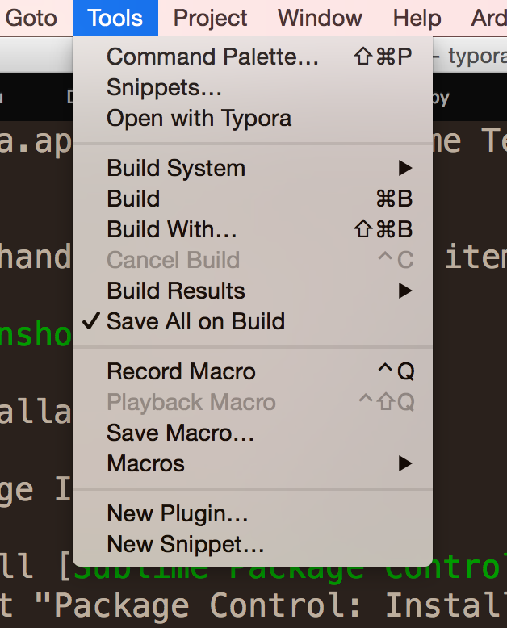
_Sublime Text Command Palette showing the "Open with Typora.app" command from the community plugin._

---

## Add Search Service (custom context-menu search)

Source: https://support.typora.io/Add-Search-Service/

The right-click context menu in Typora includes a "Search with…" submenu. This page documents how to extend it with arbitrary search engines (DuckDuckGo, Wikipedia, an internal wiki, MDN, etc.). On macOS, the list is governed by the system-wide Services preference — Typora inherits whatever the OS exposes. On Windows and Linux, the list comes from a `searchService` array inside `conf.user.json`, reached via **Preferences → Open Advanced Settings**.

Each entry is a two-element array: the label that appears in the menu and a URL template where `%s` is substituted with the highlighted text. By default the array contains a single "Search with Google" entry. After editing the JSON, Typora must be restarted before changes take effect.

The Iliad analogue is clear: **a small, JSON-driven extension point for context-menu lookup actions** keeps the editor minimal while letting power users wire in their own knowledge bases.

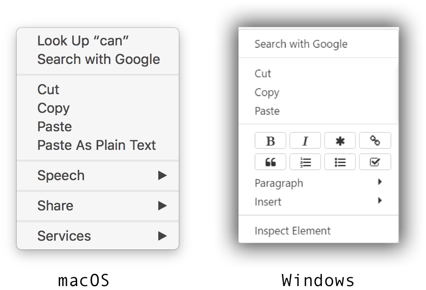
_Right-click context menu showing a custom search-engine entry._

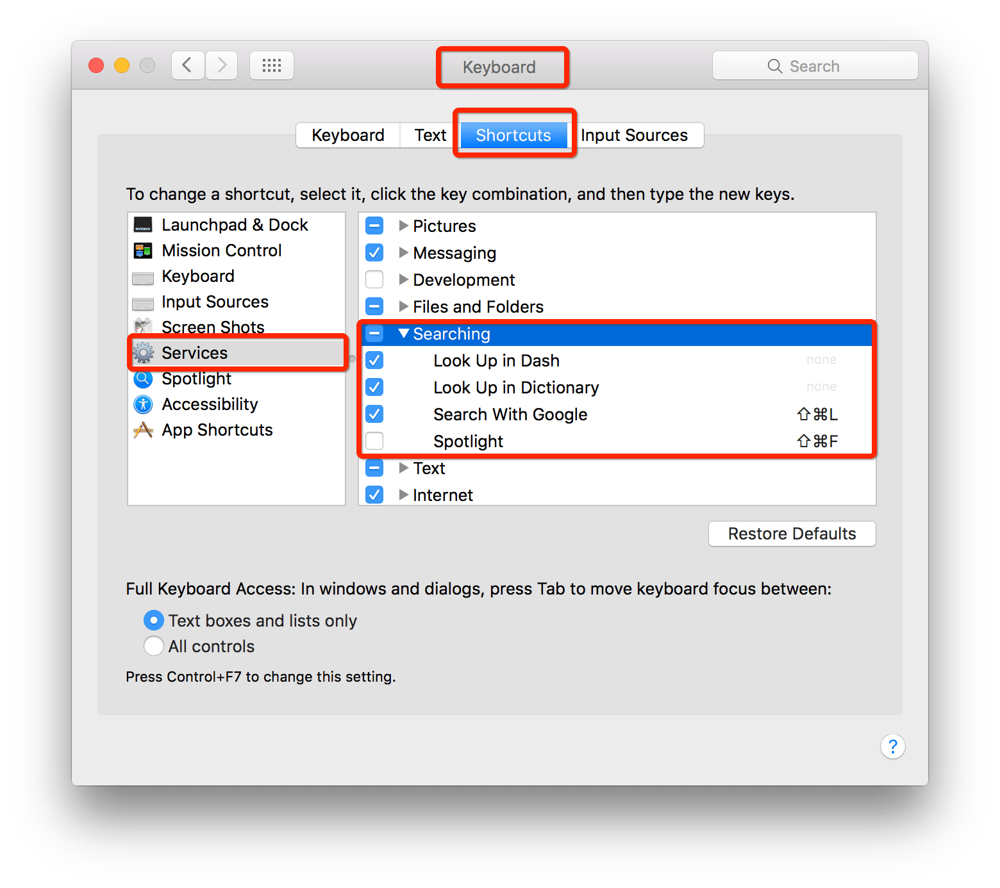
_macOS System Preferences pane where Services entries are toggled on/off._

_The Advanced Settings dialog that exposes `conf.user.json` on Windows/Linux._

---

## Use Typora from Shell / Command Prompt

Source: https://support.typora.io/Use-Typora-From-Shell-or-cmd/

The article documents three platform recipes for launching Typora from a terminal. On **macOS**, the most basic invocation is `open -a typora foo.md`, and if Typora is set as the default `.md` handler, plain `open foo.md` is enough. Two alias patterns are suggested for `~/.bash_profile`: one that uses `open -a`, and a richer one that points at the executable inside the `.app` bundle so that **invoking the alias on a non-existent path prompts to create the file** instead of failing.

On **Windows**, the trick is to first wire Typora as the default `.md` handler (right-click → Properties or Open with → Choose another app, tick "Always use this app"). After that, `.\example.md` or `start example.md` both work. Adding the install directory to `PATH` enables a bare `typora foo.md` command that also creates new files when the target is missing. On **Linux**, the binary is on `PATH` already, so `typora ~/Documents/test.md` just works.

For Iliad, this is the basic CLI ergonomics checklist: a top-level executable on `PATH`, "create on open" semantics, and OS-level file-type registration.

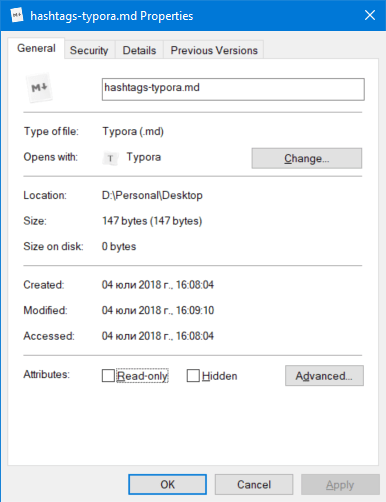
_Properties dialog used to set Typora as the default markdown handler on Windows._

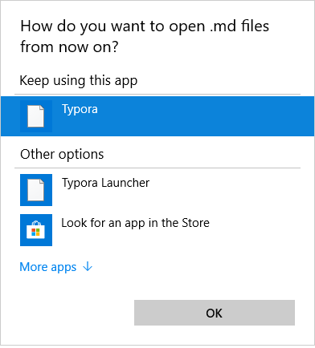
_The "Choose another app" picker showing Typora as an option for `.md` files._

---

## Launch Options

Source: https://support.typora.io/Launch-Options/

Typora's Preferences panel exposes a small but important choice: **what should happen when the app cold-starts?** The options are open a fresh untitled file, restore the last folder that was open, restore both the last file *and* folder, or open a fixed user-chosen folder. This is the kind of preference users hit immediately after install and rarely touch again.

The page also calls out a macOS-specific subtlety: the system-wide "Close windows when quitting an app" setting (under System Settings → Desktop & Dock) overrides Typora's restore logic. When that box is **unchecked**, macOS will auto-restore the previous session's windows regardless of what Typora's own preference says. This kind of OS-vs-app interplay is worth Iliad modelling explicitly rather than letting it leak through as a mystery.

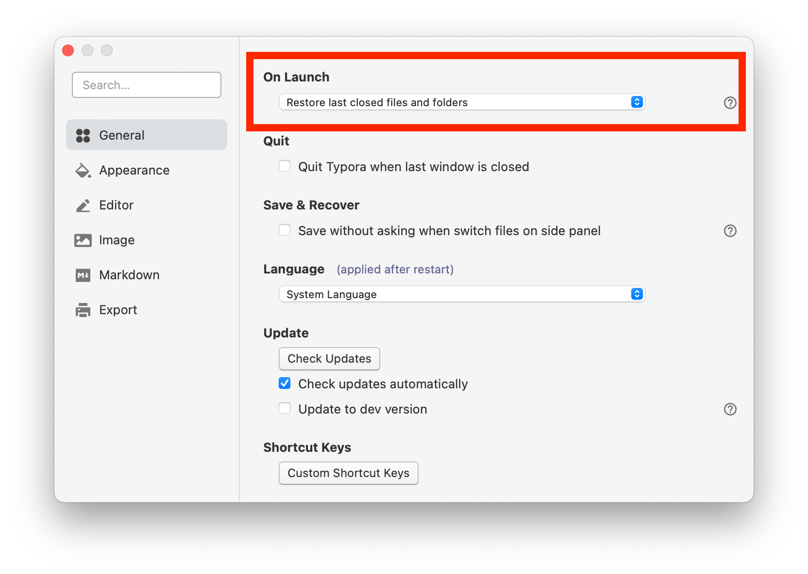
_Preferences panel showing the four cold-start options._

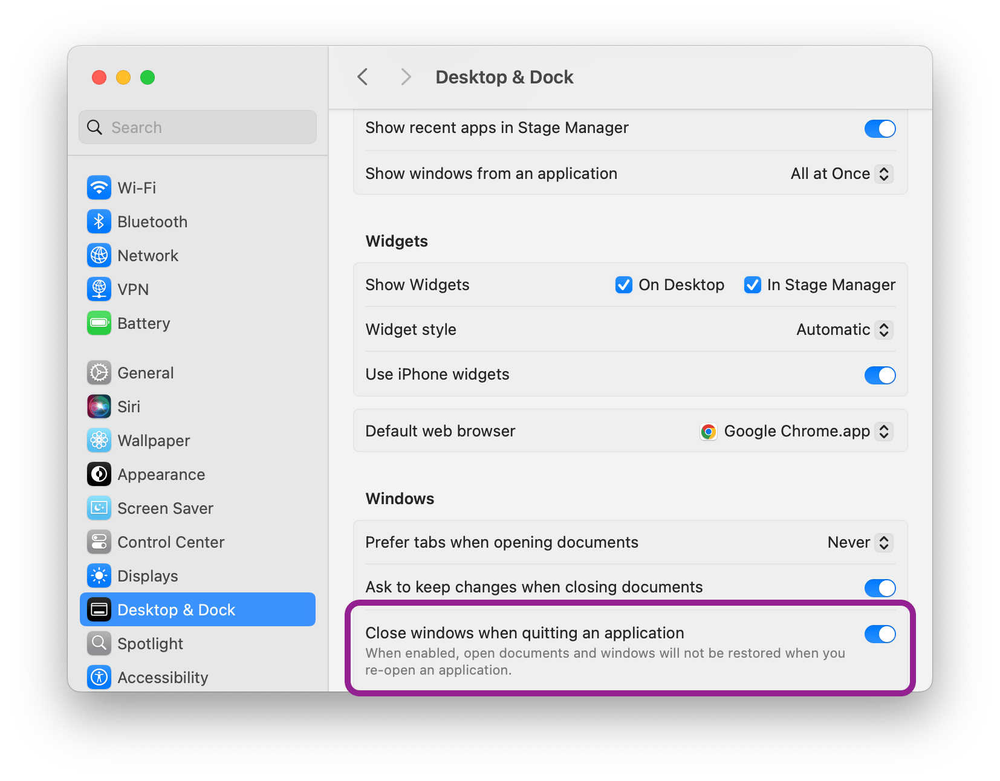
_macOS Desktop & Dock pane where session-restore behaviour is toggled at the OS level._

---

## Upload Image

> **CONDITIONAL under [source-as-contract](../source-as-contract.md).** **REJECTED** when the editor uploads silently at save time and rewrites local refs to CDN URLs — that's an invisible source mutation. **Safe** when exposed only as an explicit user command (right-click → "Upload this image", or a one-shot "Upload all images" action) so the rewrite shows up as a user-initiated edit in the next diff.

Source: https://support.typora.io/Upload-Image/

This is one of the most feature-rich how-tos in the set. Typora doesn't host images itself — instead, it **delegates image upload to external tools** and orchestrates them. The Preferences → Image pane exposes a dropdown of supported uploaders (iPic, uPic, Picsee on macOS; PicGo-Core CLI cross-platform; PicGo.app and PicList for the Chinese ecosystem; Upgit; plus a fully **custom command** option that lets users plug in anything that accepts a filename and prints a URL). A **"Test Uploader"** button validates the configuration end-to-end and surfaces upload errors in a result dialog.

Upload can be triggered three ways:

- **One image at a time**: right-click an image and pick **Upload Image** from the context menu.
- **In bulk**: Format → Image → **Upload All Local Images** sweeps the entire document.
- **Automatic on insert**: a "When Insert…" section in preferences with checkboxes for "Apply above rules to local images", "Apply above rules to online images", and "Allow upload images automatically based on YAML settings" turns inserted images into uploads transparently.

Per-document opt-in works through the YAML key `typora-copy-images-to: upload`. For PicGo-Core specifically, Typora offers a **"Download"** button that fetches a prebuilt binary so non-CLI users can still use it. Custom commands accept `${filename}` and `${filepath}` variables.

The takeaway for Iliad: an image pipeline that has a clean shape — single uploader interface, validation button, per-insert/per-document/per-file granularity, manual and automatic modes — is enormously useful and feels like a first-class feature even though almost all the work is done by third-party binaries.

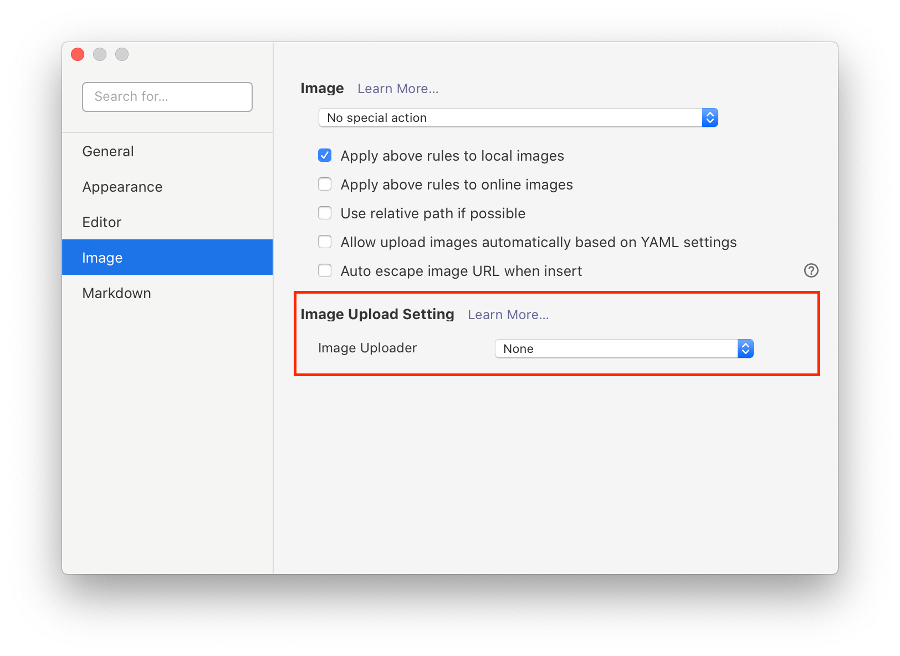
_The main image-uploader preferences pane with the uploader dropdown._

_The Test Uploader button, used to verify the configured uploader end-to-end._

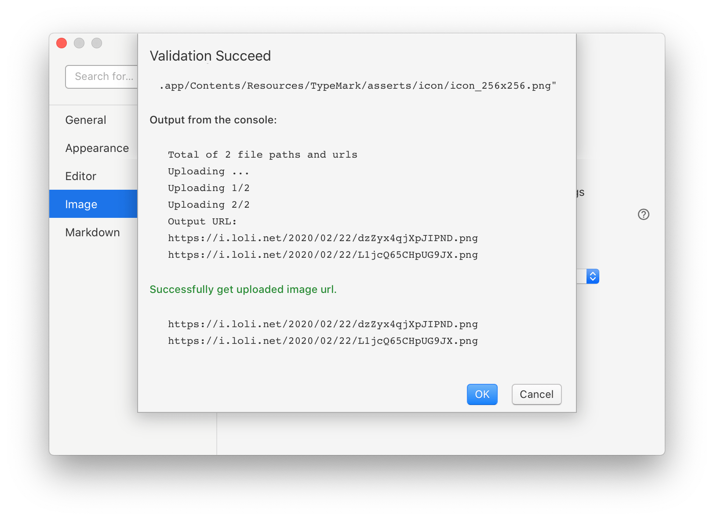
_Dialog showing the result (URL or error) of a Test Uploader run._

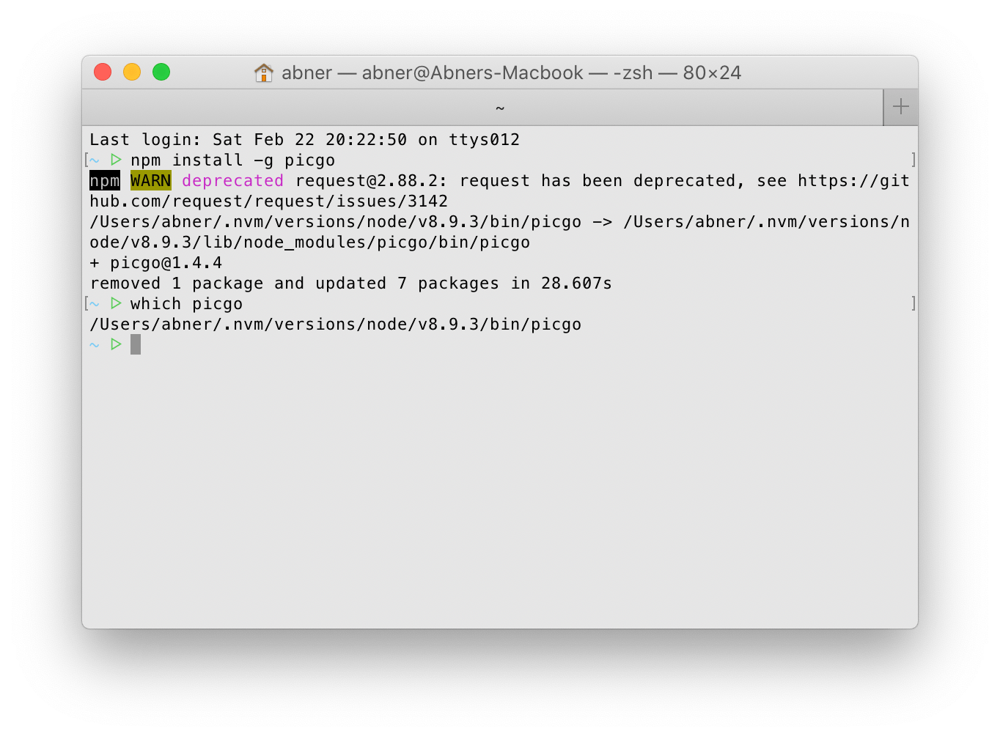
_Built-in installer button that downloads the PicGo-Core binary._

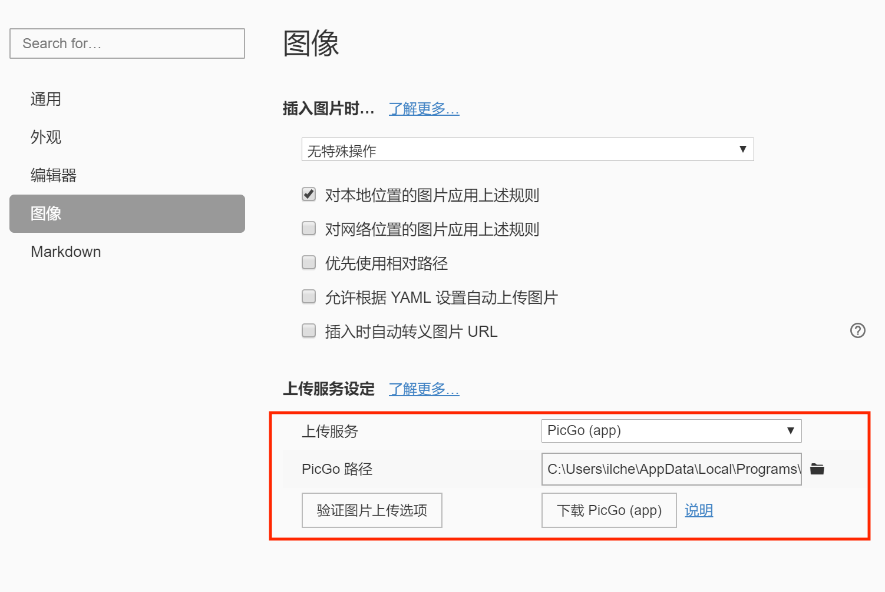
_Path-to-binary input for PicGo on Linux/Windows._

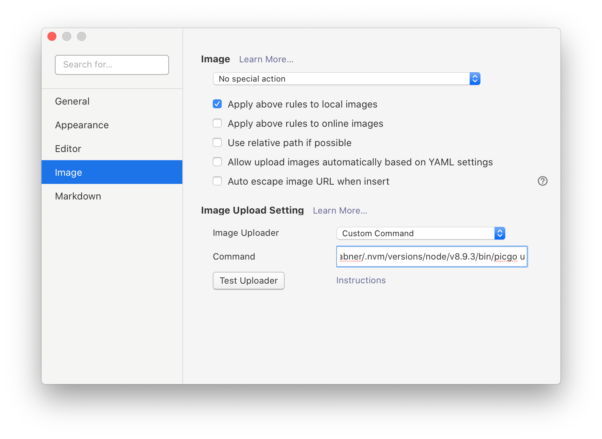
_The custom-command field where users wire in their own uploader binaries._

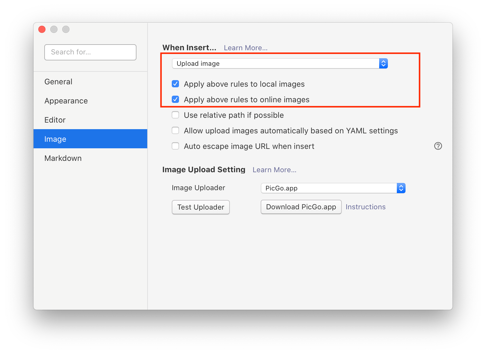
_Checkboxes that control automatic uploads when images are inserted._

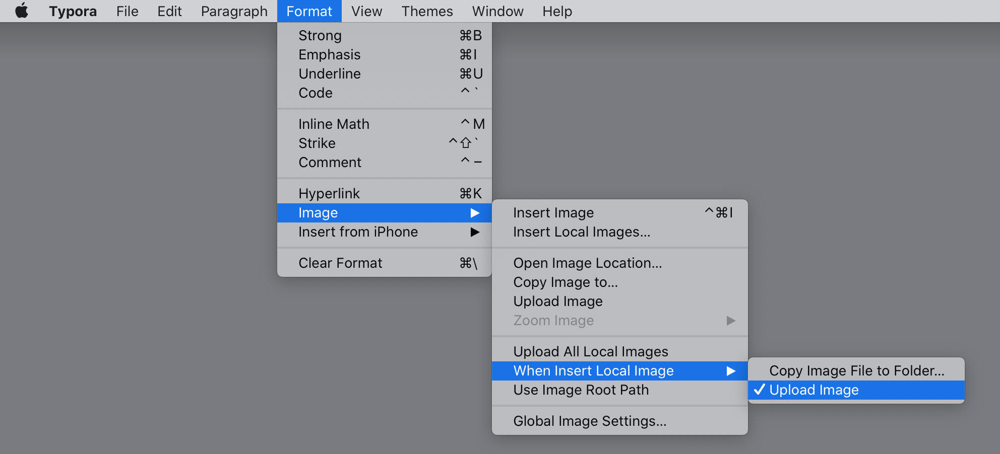
_Format → Image submenu containing "Upload All Local Images"._

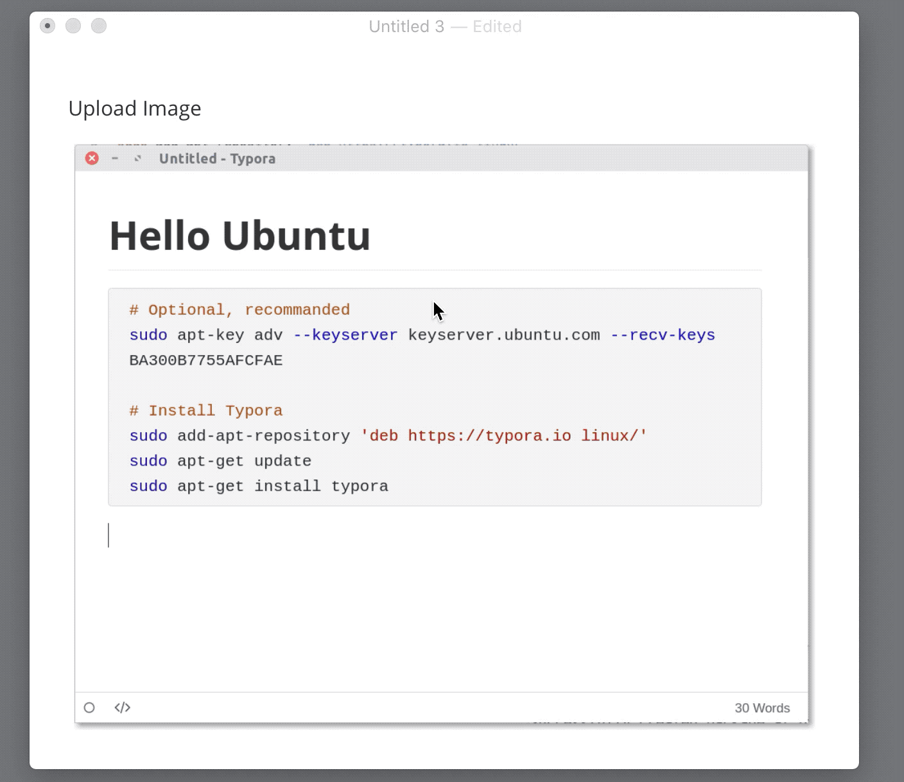
_Animation showing the right-click "Upload Image" command running on a single inline image._

---

## Get Logs

Source: https://support.typora.io/Get-Logs/

A short troubleshooting page that explains where Typora writes diagnostic logs on each OS. On **macOS**, logs are routed through `os_log` and surface in Apple's Console.app: users open Console, filter by the Typora process, and can flip on "Include Info Message" and "Include Debug Messages" (from the Action menu) for more verbose output. For incidents that have already happened, Console can load past logs captured with `sudo log collect --last 10m` (the duration is configurable — `3h`, `1d`, etc.), opened with `open system_logs.logarchive`, and finally cleaned up with `rm -rf system_logs.logarchive`.

On **Windows**, logs live under `C:\Users\<user>\AppData\Roaming\Typora`. On **Linux**, the page directs users to the preference panel option **"Open Theme Folder"** as a shortcut to the parent data directory where logs sit.

For Iliad, the design lesson is: **don't reinvent the log viewer** — lean on OS-native log infrastructure where it exists (macOS) and surface filesystem paths everywhere else, with a one-click "reveal in file manager" button.

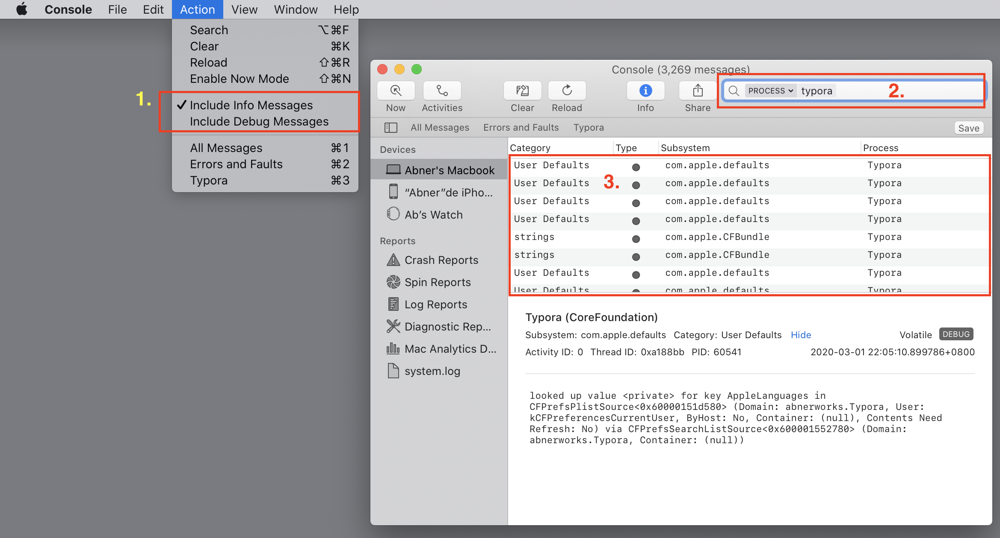
_Console.app with the Typora process filtered and Include-Info enabled._

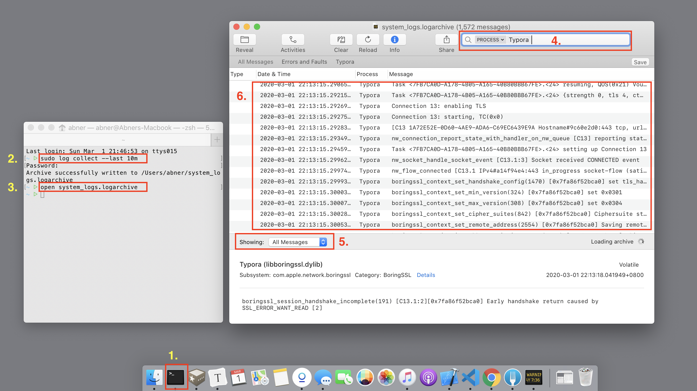
_A collected log archive opened in Console.app for post-mortem analysis._

---

## Launch Arguments

Source: https://support.typora.io/Launch-Arguments/

Typora accepts both Typora-specific and Chromium-inherited command-line flags. The Typora-specific ones are short:

- `--new` — always start with a fresh untitled document, overriding the saved launch preference.
- `--reopen-file` — force the last-closed files to reopen, overriding preferences in the other direction.

Because Typora is built on Electron/Chromium, it also accepts the full set of Chromium flags. The page calls out the most useful ones for users:

- `--disable-gpu` — turn off hardware acceleration; the standard fix for Linux rendering glitches.
- `--client-certificate="path"` — load a client cert for HTTPS resources.
- `--proxy-server=address:port` — force an HTTP/HTTPS/WebSocket proxy that overrides system settings.
- `--proxy-pac-url=url` — use a PAC file for proxy auto-config.
- `--host-rules=rules` — comma-separated host-mapping rules.
- `--no-sandbox` — disable the Chromium sandbox (escape hatch).

For users who can't or don't want to launch from a shell, these arguments can also be persisted in `config.user.json` under a `flags` array (e.g. `"flags": [["proxy-server", "address:port"]]`). This is **a dual-surface pattern worth copying**: every flag is both a CLI argument and a config key, so the same option is available whether you launch from a launcher icon or a terminal.

---

## New File from Context Menu (Windows)

Source: https://support.typora.io/New-File-in-Context/

Out of the box, Windows Explorer's right-click → New menu doesn't include "Markdown File" because the OS doesn't ship a registered `.md` type. The article documents the registry edits needed to add it: a downloadable `.reg` file that sets three keys (`HKEY_CLASSES_ROOT\.md` → `markdown`, `HKEY_CLASSES_ROOT\.md\ShellNew` → `NullFile`, and `HKEY_CLASSES_ROOT\markdown` → "Blank Markdown file"). Once merged, "Markdown File" appears in Explorer's New submenu.

On **macOS**, the page recommends third-party utilities (Easy New File, New File Menu from the App Store) since the OS doesn't expose an equivalent extension point cleanly.

The takeaway is small but real: **OS-level new-file integration is a friction point worth solving at install time**, not leaving as a manual registry chore.

---

## Text Snippets

> **REJECTED by [source-as-contract](../source-as-contract.md).** Auto-expansion at typing time means the user's typed shorthand and the on-disk source diverge — the same failure mode as SmartyPants. The AI assistant would see expanded prose while the user remembers writing a trigger; every round-trip becomes a guessing game.

Source: https://support.typora.io/Text-Snippet/

Typora explicitly **does not** ship a snippet/text-expansion feature. The article instead points users at OS-level and third-party alternatives. On macOS, snippets and replacements can be configured under System Settings → Keyboard → Text, and the small `wordservice` utility adds date/time and filepath insertion services. Cross-platform recommendations are **aText**, **TextExpander**, **espanso**, and **PhraseExpress** (espanso being the only one that runs on Linux too).

This is itself a design choice worth noting for Iliad: text expansion is a complete product category, and integrating shallowly is usually worse than deferring to the user's existing expander.

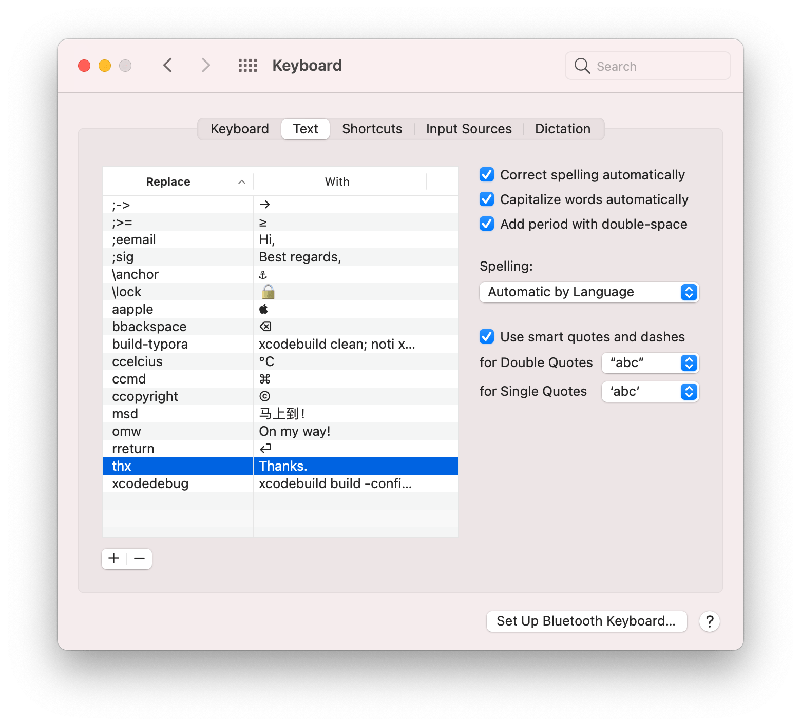
_macOS System Preferences → Keyboard → Text pane where text replacements are configured._

---

## Typeset (CSS-Driven Layout Tweaks)

> **BORDERLINE under [source-as-contract](../source-as-contract.md).** CSS that styles existing canonical Markdown is safe (it lives in the editor, not the document). CSS that requires the user to wrap content in `
` or add HTML scaffolding to get layout effects is **REJECTED** — the document becomes interpretable only by editors that ship that stylesheet.

Source: https://support.typora.io/Typeset/

This is a hub page that aggregates the many ways custom CSS can reshape Typora's rendering. Because Typora is essentially a styled HTML view, the whole CSS surface is fair game. The article catalogues the kinds of changes users commonly make:

- **Page**: background color, writing-area width.
- **Text & font**: family, color, size, uppercase or small-caps headers, ligature variants (common, discretionary, historical, contextual).
- **Paragraph**: line and paragraph spacing, justify alignment, center alignment for headers or images, right-to-left mode, vertical writing (`writing-mode: vertical-rl`).
- **Components**: list bullet styles, auto-numbered headings/outline/TOC, controlling TOC depth, syntax-highlight themes inside code blocks, "erasing" (striking through) completed task items, styling Mermaid and sequence diagrams.
- **Editing UX**: focused/unfocused paragraph styling in Focus Mode, writing direction, **preventing markdown markers from auto-hiding** (a small but very specific affordance that some users prefer).

There are no images on this page; everything is delivered as short CSS snippets users paste into their custom theme. The interesting move for Iliad is that **the editor's rendering rules are intentionally exposed as ordinary CSS**, so power users get full control without needing a custom DSL.

---

## Markdown Export / Reformat

> **BORDERLINE under [source-as-contract](../source-as-contract.md).** A reformat command is an explicit source mutation, which is allowed — but only if triggered by the user (menu item, shortcut, palette) with the diff visible afterward. Reformatting on save is **REJECTED** for the same reason as SmartyPants: the file no longer reflects what the user typed.

Source: https://support.typora.io/Markdown-Export/

The "Markdown (other spec)" export turns Typora into a markdown-to-markdown reformatter and dialect converter. Selected via Preferences → Export → Markdown (other spec), it pipes the current file through Typora's AST and then back out through Pandoc, **converting between markdown flavours** (CommonMark, GFM, MultiMarkdown, Pandoc's own variants, etc.). The conversion is AST-based, so non-essential whitespace and ordering may change.

The export dialog exposes four key formatting toggles that map directly onto Pandoc options:

- **Line wrap** — hard-wrap at N columns (e.g. 80) — equivalent to `--columns=N`.
- **End of line** — Unix `\n` vs Windows `\r\n` — equivalent to `--eol=lf|crlf|native`.
- **Indent** — spaces per tab (default 4) — equivalent to `--tab-stop=N`.
- **ASCII only** — convert non-ASCII to HTML entities (e.g. CJK becomes `&#XXXXX;`) — equivalent to `--ascii`.

Two further power-user features stand out. **"Reformat"** from the Export menu applies these rules to the current file *in place*, turning the dialog into a one-shot prettifier. **Custom-command export** lets users plug in tools like Prettier (or any binary) as a post-processor; combined with **"Run Command" after-export hooks**, multiple steps can be chained into a single export action.

For Iliad, this is the design pattern of **"export = AST → optional custom command → file"** as a single composable pipeline. Even a tool like Prettier becomes a first-class export target.

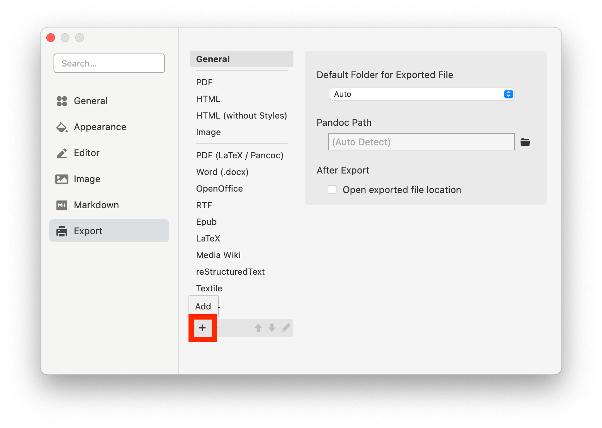
_Preferences → Export pane._

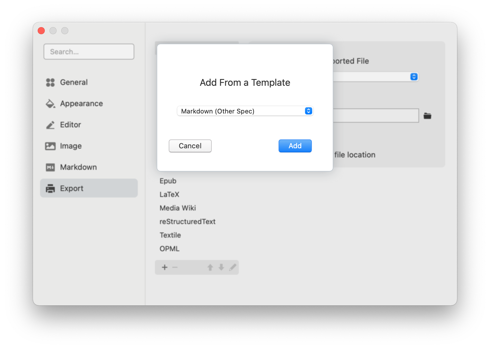
_Choosing the "Markdown (other spec)" export template._

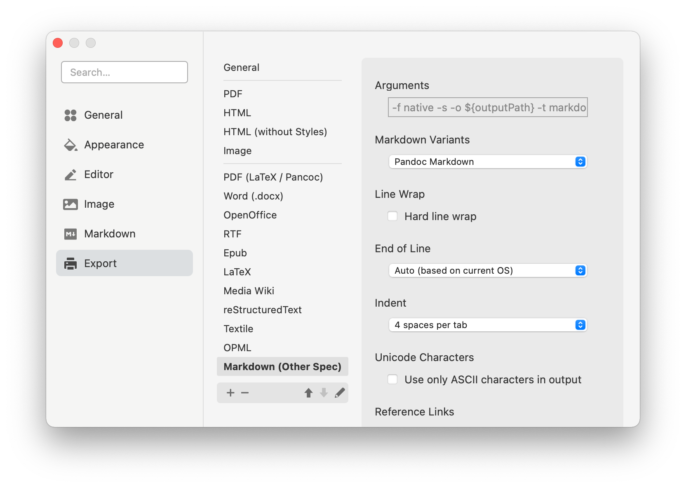
_Picking the target markdown dialect (CommonMark / GFM / etc.) and tuning the format toggles._

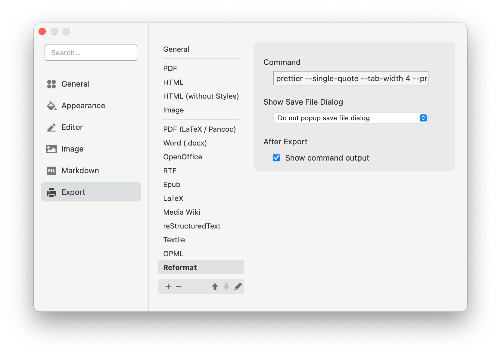
_Custom-command field for piping the exported file through an external formatter like Prettier._

---

## YAML Front Matter

> **BORDERLINE under [source-as-contract](../source-as-contract.md).** Front matter is metadata, not document body — it round-trips cleanly with parsers that know about it, but plain Markdown renderers display it as literal text. Worth the cost only if users need static-site-generator interop; if you ship it, write the convention down.

Source: https://support.typora.io/YAML/

YAML front matter is a metadata header at the top of the file, fenced by `---` lines. Typora reads it for both display and export. **Export pipelines pick up metadata automatically**: PDF and HTML exports use `title`/`author`/`keywords`/`subject`/`creator`; HTML title tags come from the `title` key; Pandoc-driven exports get full LaTeX `header-includes`, etc. Export settings can reference YAML values via `${variable}` substitution in the Preferences UI.

Typora reserves a set of `typora-`-prefixed keys (each also available without the prefix) for per-document overrides of features that are otherwise global:

- `typora-root-url` — base path used to resolve relative image URLs.
- `typora-copy-images-to` — controls what happens to dropped/pasted images.
- `header` / `typora-header`, `footer` / `typora-footer` — PDF page header/footer.
- `sidebar` / `typora-sidebar` — include the sidebar in HTML export (boolean).
- `append-head` / `typora-append-head` and `append-body` / `typora-append-body` — inject arbitrary content into HTML `<head>` and `<body>` at export time, plus `-extra` variants that add to the defaults instead of replacing them.

For security, reading these export-affecting keys requires opting in to **"Read and overwrite export settings from YAML front matter"** in preferences.

Syntactically, Typora's parser is described as "flexible / fault-tolerant", and supports the standard YAML niceties: inline lists, pipe-delimited multiline strings (`|`), and nested objects. **Indentation must be spaces** (tabs are rejected) and keys are case-sensitive.

The interesting Iliad lesson: **per-file overrides delivered as YAML keys** is a clean way to keep most documents driven by global preferences while still giving authors precise control on a per-file basis for things like image paths, headers/footers, and HTML injection.

---

## Delete Range

Source: https://support.typora.io/Delete-Range/

Typora ships with four levels of "smart delete" that go beyond character-by-character backspace:

- **Delete Paragraph / Block** — removes the entire current block (heading, paragraph, list item, code block, etc.).
- **Delete Line / Sentence** — context-aware: deletes the current sentence inside prose paragraphs, the current row inside tables, the current line inside code/math blocks, and (when the block is empty) the block itself.
- **Delete Styled Scope** — deletes the surrounding run of identically-styled inline text (e.g. a single bold span).
- **Delete Word** — removes the word under the cursor.

The page is illustrated with GIFs of each command in action; no explicit keyboard shortcuts are listed, but these commands are bound to standard editor shortcuts.

For Iliad, this is the kind of **cursor-context-aware editing primitive** that distinguishes a Markdown-aware editor from a plain text editor — the same key does the right thing whether the cursor is in a table cell, a code block, or a paragraph.

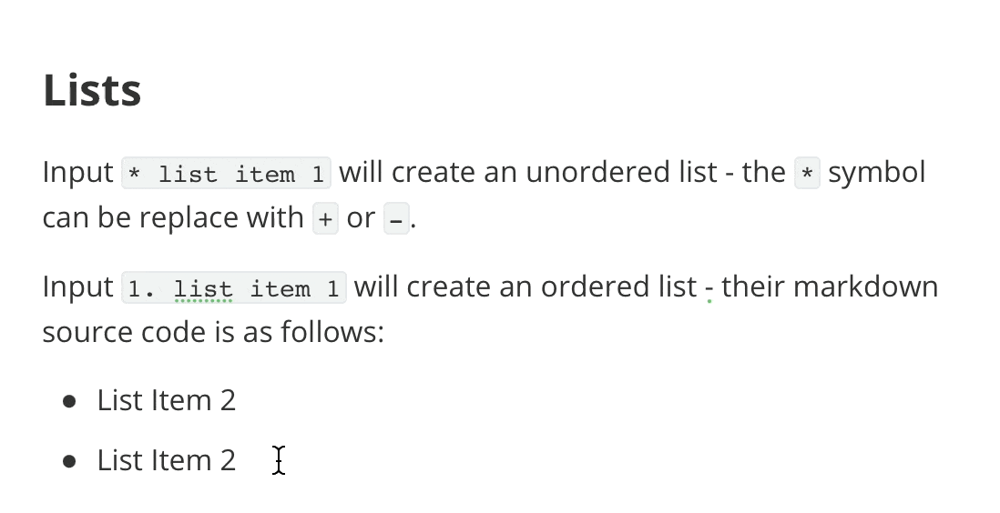
_Demo of deleting the current paragraph or block as a single unit._

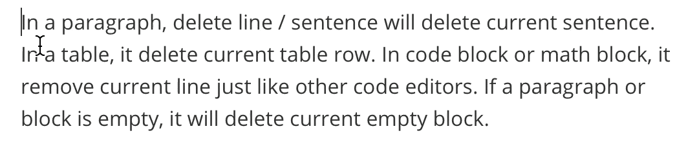
_Demo of the context-sensitive line/sentence/row delete behaviour._

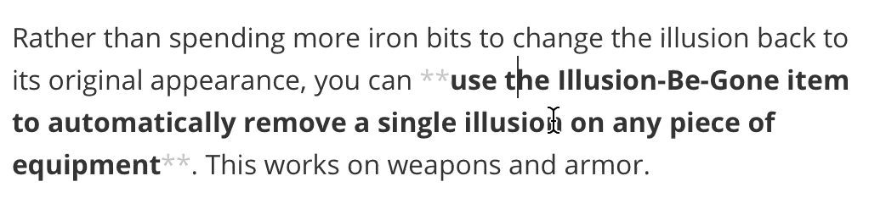
_Demo of deleting the surrounding inline-styled run (e.g. a single bold span)._

---

## Snap (Linux)

Source: https://support.typora.io/Snap/

The Snap distribution of Typora on Linux is a one-line install (`snap install typora`) and supports both x64 and ARM. It can also be installed from the desktop store via a `snap://` link. Because Snap runs the app in a confinement sandbox, several restrictions apply: **file access is limited to `~/` and `/media`**, **binaries from `/usr/bin` or `/usr/local/bin` cannot be executed**, and Typora bundles its own sandboxed Pandoc for export. Anything else the user wants to call (custom uploaders, formatters, etc.) must live inside the home directory or be linked there.

The Iliad lesson is the cost of sandboxing for an editor that wants to shell out: sandboxes break the "just install a CLI tool" assumption that desktop editors usually rely on.

---

## Advanced Config (`conf.user.json`)

Source: https://support.typora.io/Advance-Config/

This is the meta-page for Typora's power-user config file. Preferences → General → Advanced Settings exposes two buttons — **"Open Advanced Settings"** (opens `conf.user.json` in the default JSON handler or its containing folder) and **"Reset Advanced Settings"**. The file is plain JSON with `//` comments allowed, and the article carefully lists the JSON syntax rules (commas between pairs, double-quoted keys/strings, lowercase booleans, no leading zeros on numbers, `{}` and `[]` for empty containers).

Several specific config keys are highlighted:

- `defaultFontFamily` — fallback when custom CSS uses generic names like `sans-serif`.
- `autoHideMenuBar` — when true, the menubar hides until Alt is pressed.
- `searchService` — adds entries to the context-menu "Search with…" submenu (see also the Add Search Service article above).
- `keyBinding` — remap keyboard shortcuts on Windows/Linux.
- `monocolorEmoji` — boolean; true forces emoji to render in the same color as surrounding text (Windows), false keeps the iOS/Android-style color emoji.
- `flags` — the launch arguments to apply on startup (see Launch Arguments above).

The pattern Iliad can borrow: **a single JSON file with comments**, paired with both an "open in editor" and a "reset to defaults" button. Every UI preference and every CLI flag ends up addressable from one place.

---

## Search (in-document and across files)

Source: https://support.typora.io/Search/

Typora exposes three distinct search surfaces:

- **Find and Replace inside the current file** — `Cmd/Ctrl + F` opens find, `Cmd/Ctrl + H` opens find-and-replace. Each panel has toggles for case sensitivity, whole-word matching, and regex. In regex mode, replacement strings can reference capture groups with `$0`, `$1`, `$3`, etc.
- **File search across the opened folder** — accessed from the search icon in the sidebar (File Tree or Articles view), via View → Search, or via the displayed shortcut. Supports the same case / whole-word / regex toggles as Find.
- **Open Quickly (fuzzy file-name search)** — `Cmd + Shift + O` on macOS, `Ctrl + P` on Windows/Linux. Searches both files in the currently open folder and the recent-files list.

This is the standard "three-tiered search" pattern from IDEs (find in file, find in folder, jump to file) applied to a markdown editor. The Iliad equivalent should keep the same affordances under the same shortcuts since they're now muscle memory.

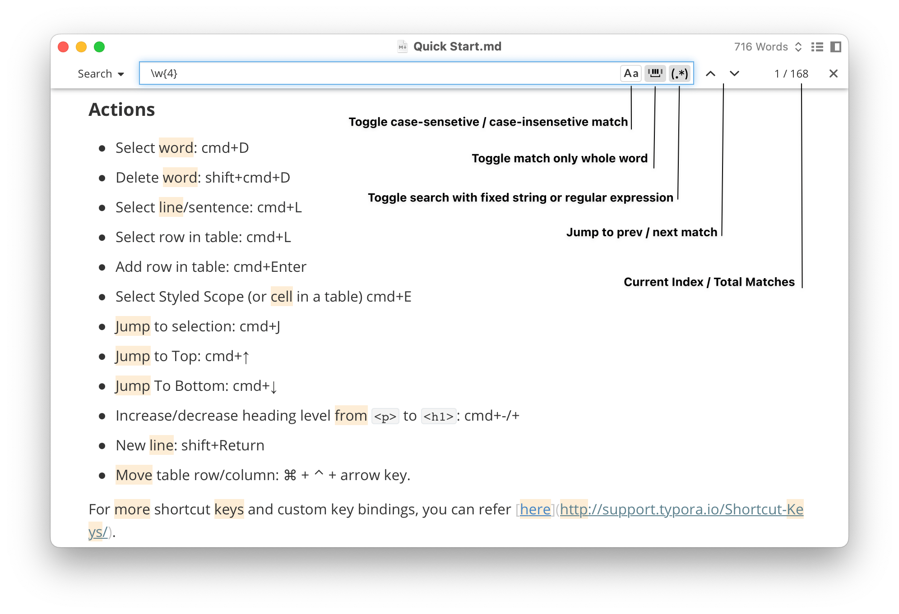
_In-file find-and-replace panel with case/word/regex toggles._

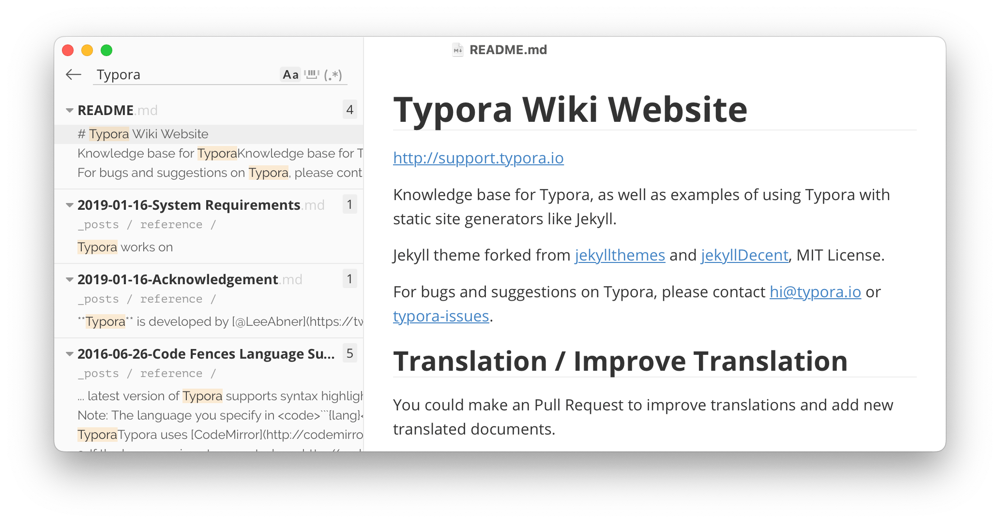
_Sidebar-driven full-text search across all files in the current folder._

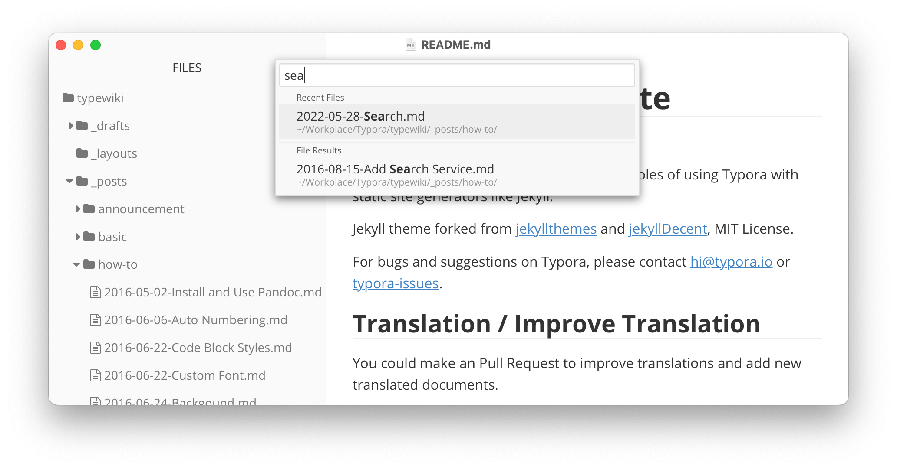
_Fuzzy file-name finder, equivalent to "Go to File" in IDEs._

---

## Table of Contents (`[toc]`)

> **BORDERLINE under [source-as-contract](../source-as-contract.md).** The `[toc]` token is non-standard; renderers other than Typora may show it as literal text or strip it. A sidebar outline panel (no token in the file) is the safer alternative. Ship the token form only if a real use case requires the TOC to be part of the document body.

Source: https://support.typora.io/TOC/

To insert a table of contents anywhere in the document, the user types `[toc]` on its own line and presses Return. Typora replaces the literal text with a live, auto-updating TOC node that pulls in every heading h1–h6. The TOC keeps itself in sync as headings are added, renamed, or removed, and it survives **export to HTML, PDF, and other built-in targets**. There is also a menubar shortcut under Insert → Table of Contents.

For users who want a TOC view *without* embedding it in the document, Typora's **Outline** panel provides the same heading list as a sidebar. The TOC's visual format is fully controllable via custom CSS — common patterns shown on the page include hiding `h6` (`.md-toc-h6 { display: none; }`) and adding automatic numbering, both as small CSS snippets.

The Iliad cue: a TOC is two features in one — **a live embedded node in the document, and a sidebar view** — both fed from the same heading-extraction logic.

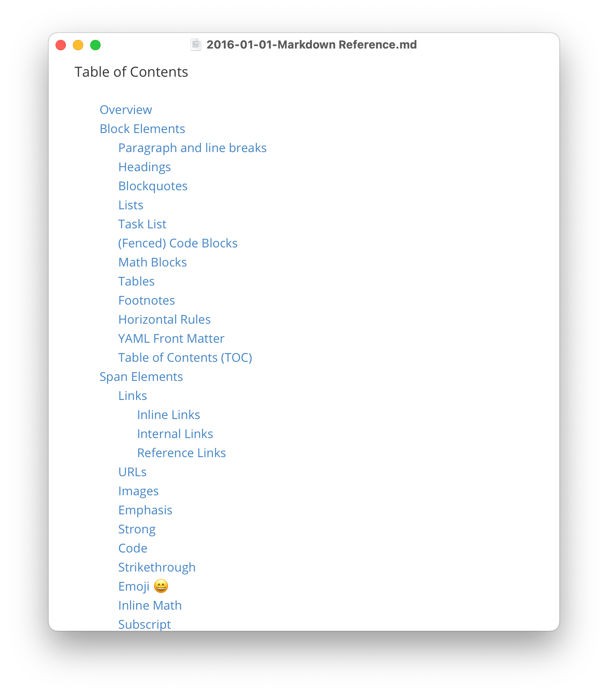
_The menubar entry that inserts a `[toc]` block at the cursor._

---

## Debug Themes (DevTools)

Source: https://support.typora.io/Debug-Themes/

When custom CSS doesn't behave, Typora exposes a Chromium-style DevTools inspector so theme authors can poke the live DOM. On modern **macOS** (macOS ≥ 13.3 with Typora ≥ 1.9), DevTools is now driven through Safari: enable Web Inspector in Safari → Settings → Advanced → Web Inspector, then open Safari → Develop → [device name] → Typora. On **older macOS**, a "debug mode" toggle in Preferences → General (followed by a restart) unlocks a right-click → **Inspect Element** entry directly inside the writing area.

On **Windows / Linux**, the inspector is a top-level menu item: View → **Toggle DevTools**.

Two illustrative screenshots show the Safari path on modern macOS. The lesson for Iliad: **don't try to ship your own inspector** — wire the chromium devtools into a single command and call it a day.

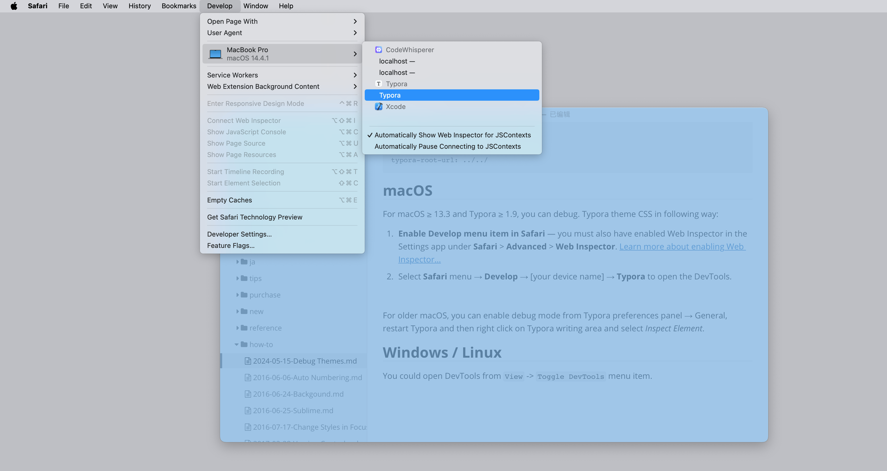
_Safari Develop menu showing Typora as an attachable inspector target on macOS._

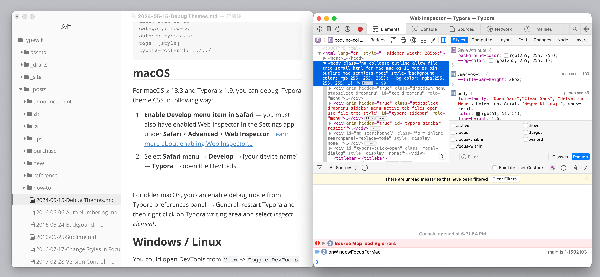
_Web Inspector window pointed at Typora's live document DOM and styles._

---

## Install and Use VLOOK

> **BORDERLINE under [source-as-contract](../source-as-contract.md).** Theme/plugin ecosystems often rely on HTML attributes, custom CSS classes, or special tokens embedded in the document. Adopt only plugins that style existing canonical Markdown — **REJECTED** for any plugin that requires authoring with new tokens or HTML scaffolding in the source.

Source: https://support.typora.io/Install-and-Use-VLOOK/

VLOOK is a third-party theme + plugin pack for Typora that produces export-ready HTML with extras (richer table of contents, hover effects, multilingual UI, etc.). Installation is a three-step ritual that's a useful case study in how Typora exposes its extensibility:

1. **Drop the theme** into Settings → Appearance → Open Theme Directory and switch to it from the Themes menu.
2. **Enable extended markdown features** Preferences → Markdown → Extended Syntax (and tweak Code Blocks options as needed) so VLOOK's syntax extensions parse correctly.
3. **Create a custom export configuration** named "VLOOK" that points at the HTML template and uses the **"Append in `<head />`"** and **"Append in `<body />`"** fields to inject VLOOK's meta tags, language packs, and plugin scripts. Exports then run via File → Export → VLOOK.

VLOOK supports a long list of languages out of the box (French, German, Russian, Spanish, Portuguese, Traditional Chinese, Japanese, Korean, Arabic) and recommends Chrome, Edge, or Firefox to view its output.

The architectural takeaway for Iliad: **a "custom export profile" that lets users inject arbitrary `<head>` and `<body>` content turns the export step into a plugin surface** — entire third-party theme ecosystems can ride on it without changes to the core app.

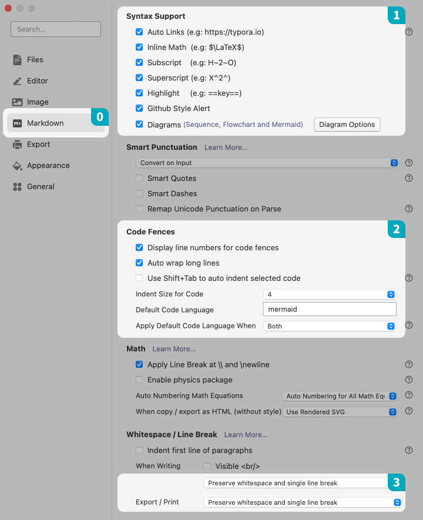
_Typora preferences pane showing the Markdown / Extended Syntax options VLOOK relies on._

---

## Open in Typora (VS Code Extension)

Source: https://support.typora.io/Open-in-Typora-VS-Code-Extension/

A small VS Code / Cursor extension that adds **"Open in Typora"** to the right-click context menu on markdown files (both in the Explorer sidebar and on editor tabs). One click hands the file off to Typora while leaving the VS Code instance running, so developers can dip into a WYSIWYG view for prose-heavy passes without losing their editor session.

Defaults cover the usual markdown extensions — `.md`, `.markdown`, `.mdown`, `.mmd`, `.text`, `.txt`, `.rmarkdown`, `.mkd`, `.mdwn`, `.mdtxt`, `.rmd`, `.qmd`, `.mdtext`, `.mdx`. The list is configurable via the `typora.supportedExtensions` setting (Preferences → Settings, `Ctrl/Cmd+,`). Extensions are installed from the Extensions view (`Ctrl/Cmd+Shift+X`). Requirements are Typora installed, VS Code 1.85.0 or later, and on Windows/Linux a `typora` command on `PATH`.

The Iliad cue: shipping a tiny editor-side extension is the cheapest way to insert yourself into a developer's existing workflow.

---

## Older macOS Support

Source: https://support.typora.io/Older-macOS-Support/

The current Typora build requires macOS ≥ 11. The page lists working legacy installers for users still on older systems: 1.4.8 for macOS 10.14–10.15, 0.9.9.32.1 beta for 10.13, 0.9.9.26.7 beta for 10.11–10.12, and 0.9.9.25.3 beta for 10.10. No new features land in these builds — Typora explicitly notes support has ended for them. The takeaway for Iliad is simply that publishing a per-version download matrix is the right user-facing artifact when you drop OS support.

---

## Older Windows Support

Source: https://support.typora.io/Older-Windows-Support/

Same pattern as the macOS legacy page: Windows 10/11 get the latest build, and Windows 7/8 are pinned to **Typora 1.5.12**, with separate 64-bit (`typora-setup-x64-1.5.12.exe`) and 32-bit (`typora-setup-ia32-1.5.12.exe`) installers. No images, no special UI — just the download links.
